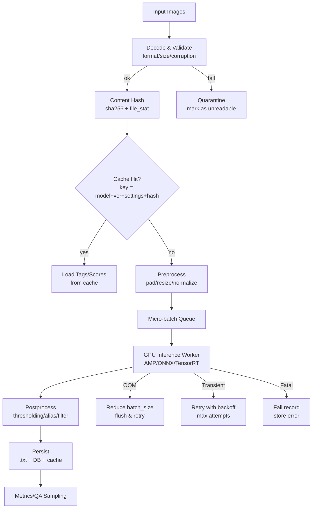

# JoyTag と Stable Diffusion 向け画像タグ付けパイプラインの実運用調査

## エグゼクティブサマリー

JoyTag は Danbooru 系タグ体系（約 5000+ タグ）に沿って画像をマルチラベル分類する「タグ付け専用」モデルで、学習データが Danbooru に偏りがちな領域に対し、補助データ（手動タグ付け画像）で“写真など Danbooru 外”への一般化を意識している点が特徴です。モデル仕様は ViT-B/16・入力 448×448・約 91.5M パラメータで、公開指標として **F1=0.578（threshold 0.4）** が示されています。citeturn10search0

Stable Diffusion の実データセット作成パイプラインで現場採用が多い近縁ツールとしては、WD14 系（SmilingWolf 系モデルを中心に ONNX で高速推論されることが多い）と、古典的な DeepDanbooru 系が挙げられます。WD14 系は公開モデルカードで **F1=0.6854（P=R となる threshold 0.3771）** のような指標が明示され、ONNX のバッチ推論（batch dimension が固定 1 でない）も言及されています。citeturn5view0　一方、DeepDanbooru は「モデルが古い」ことを前提に比較されることが多く、sd-scripts 側の日本語ドキュメントでも「WD14Tagger の方が精度が良いようです」と案内されています。citeturn7search5turn16search18

性能面は「純推論（モデル forward）」と「実パイプライン（デコード・リサイズ・I/O・記録）」で支配項が変わります。純推論の参考として、RTX 3090 上の ViT 系推論ベンチ（PyTorch AMP）では **vit_base_patch16_384 が約 491 img/s（batch 1024）** といった高い数値が報告されています（＝大きいバッチでの“理論上限”に近い測定）。citeturn26view0　しかし実データセット処理では、画像デコード・前処理・書き込みがボトルネックになりやすく、CPU 実行や CPU 側前処理が主因で GPU を替えても差が出にくい、という現象も実測ベンチで観察されています。citeturn11view0

結論として、運用で効くレバーは (a) **大きめバッチとプリフェッチ**、(b) **キャッシュ（再開可能・設定差分で自動無効化）**、(c) **しきい値の設計（カテゴリ別・校正・監査 UI）**、(d) **CUDA/ONNX Runtime の互換性事故と転送オーバーヘッド対策**です。ONNX Runtime は CUDA EP や TensorRT EP を通じた高速化が可能ですが、環境不整合（CUDA 版違い）や CPU↔GPU 転送（Memcpy ノード追加）で逆に遅くなる落とし穴が報告されています。citeturn13view0turn19view3turn19view4

---

## 対象ツールと比較

JoyTag / WD14 / DeepDanbooru はいずれも「SD 学習データ向けのタグ（主に Danbooru タグ）を自動生成する」用途で語られますが、**学習分布・タグ定義・しきい値・不得意領域**が異なるため、単一の F1 値だけで優劣を断定するのは危険です（比較条件：macro/micro 平均、しきい値選択、検証データ分布が違い得る）。JoyTag の公開 issue でも、しきい値の決め方（固定点で比較する・micro P/R を一致させる等）の重要性が議論されています。citeturn10search1turn5view0

また、実務パイプラインでは、entity["company","GitHub","code hosting platform"] 上のスクリプト（例：sd-scripts 系）やノード実装（ComfyUI / WebUI 拡張）を介して動かすことが多く、**推論ランタイム（PyTorch / ONNX Runtime / TensorRT）**と**入出力形式（.txt サイドカー / DB）**の違いが運用コストに直結します。citeturn19view4turn13view0

### タガー比較表

| タガー | 目的/出力 | 公開精度指標（注意：条件差あり） | GPU 加速の実務ルート | ライセンス | 典型的な失敗モード（例） |
|---|---|---:|---|---|---|
| JoyTag | Danbooru 系タグのマルチラベル分類（5000+）citeturn10search0 | F1=0.578（threshold 0.4、全体に写真も含むと説明）citeturn10search0 | PyTorch CUDA + AMP（公式例が `cuda` + `autocast`）citeturn10search0 / entity["company","Hugging Face","ai model hub"] で ONNX 配布も存在citeturn2view2 | Apache-2.0citeturn10search0 | 微妙な表情・主観タグ（胸サイズ等）・希少服飾（apron 等）・小さい透かし/watermark が弱いciteturn10search0 |
| WD14 系（SmilingWolf 由来） | Danbooru 系タグ + rating 等（実装により分岐）citeturn12search7turn5view0 | 例：F1=0.6854（P=R の threshold 0.3771）citeturn5view0 | ONNX Runtime CUDA EP（+ TensorRT EP も選択肢）citeturn19view4turn19view3 | Apache-2.0（モデルカード上）citeturn5view0 | 閾値依存のタグ過多/不足、CPU↔GPU 転送で速度劣化、環境差（onnxruntime-gpu/CUDA）で動かないciteturn13view0turn19view4 |
| DeepDanbooru | Danbooru 系タグ（旧来の実装・モデル）citeturn7search5 | sd-scripts 側で「WD14 的の方が精度が良いようです」と案内citeturn16search18 | 実装次第（CPU で回される事例が多い）citeturn7search5 | （要確認：派生リポジトリが多い） | モデルが古い前提でのドメイン追従不足、タグ体系・同義語整合のズレ、速度面で不利になりやすいciteturn7search5 |

---

## 性能と GPU/CPU ガイダンス

### 純推論の“上限値”ベースライン（RTX 3090）

実パイプラインの設計には、まず「モデル forward だけならどれくらい出るか」の上限を把握するのが有効です。timm 系の推論ベンチ（RTX 3090、PyTorch AMP）では次が参考になります。citeturn26view0

- `vit_base_patch16_384`：**491.42 images/sec（batch 1024）**、推論 384px、約 86.86M params。citeturn26view0  
- `eva02_base_patch14_448`：**189.13 images/sec（batch 512）**、推論 448px、約 87.12M params。citeturn26view0  

JoyTag は 448px 入力・約 91.5M params と公表されているため、パラメータ規模だけ見ると上記 2 モデルと同レンジです。citeturn10search0turn26view0  
ただし ViT の計算量は解像度（トークン数）に強く依存し、特に attention はトークン数の二乗に近いコストを持つため、**384→448 の増加は単純な面積比以上に効く**可能性がある点に注意が必要です。citeturn19view0

### 実パイプラインでの“期待スループット”レンジ

ここから先は「モデル単体」ではなく「現場のデータセット処理（デコード・前処理・書込込み）」を含むため、環境差が大きくなります。よって本節では、**(A) 上限に近い純推論**と**(B) 実務の E2E**を分けてレンジ提示します。

#### GPU（NVIDIA 20/30/40 系）での目安（JoyTag/WD14 クラス・448px）
- **純推論（GPU 上でバッチが十分大きい場合）**  
  - RTX 3090 クラス：おおむね **200〜450 img/s**（モデル/解像度/トークン化差に依存）  
    - 根拠：ViT-B 384px が 491 img/s、パラメータ近い 448px モデルが 189 img/s の実測レンジ。citeturn26view0  
- **E2E（画像デコード/リサイズ + 推論 + .txt/DB 書き込み）**  
  - 目安：**10〜150 img/s**（JPEG/PNG 比率、ストレージ、CPU コア、プリフェッチ/キャッシュ設計で大きく変動）  
  - 「GPU を上げても伸びない」例は、CPU 推論や前処理が支配すると起きます。画像タグ付けのベンチで、CPU ランタイムで回した場合に GPU 世代差が出にくい（中央値が近い）ことが報告されています。citeturn11view0  

#### CPU での目安（“とりあえず動く”が、規模で苦しくなる）
- **E2E：0.3〜5 img/s 程度**を想定し、規模が数万〜数百万枚なら GPU 前提に寄せるのが安全です。  
- CPU 実行の現実的な落とし穴は「前処理と I/O は CPU のまま → 推論だけ GPU にしても転送で詰まる」「そもそも GPU プロバイダがロードされず CPU 実行になっていた」です。後者は ONNX Runtime で典型的に起き、available providers が CPU のみになっていないかを必ず検査すべき、というガイドが明記されています。citeturn19view4turn13view0

### VRAM / RAM 見積もりとバッチサイズの考え方

バッチ最適化は「(1) VRAM に収まる最大の effective batch を探す」だけでなく、「(2) CPU 前処理が追いつく点を探す」「(3) 転送を最小化する（IOBinding 等）」の 3 点で決まります。IOBinding を使わないと CPU↔GPU コピーが発生し、CUDAExecutionProvider でも遅くなる可能性がある、と明確に注意されています。citeturn19view4turn13view0

参考までに、entity["company","NVIDIA","gpu maker"] の主要 GPU の VRAM/帯域等の世代差（2080 Ti / 3090 / 4090）をまとめた資料では、3090 と 4090 はいずれも 24GB VRAM で、CUDA コア・Tensor コア・メモリ帯域が増加していることが示されています。citeturn28view0  
このクラスの差は、**純推論では 3090 を 1.0 として 4090 が概ね 1.2〜1.6 倍程度**、一方で **E2E では CPU/I/O が支配すると差が縮む**、という設計上の期待につながります（E2E の支配項は前処理/転送のため）。citeturn11view0turn19view4turn28view0

#### 実運用向け：バッチサイズ初期値（448px タガー想定）
下表は「まず OOM を避けつつ GPU を遊ばせない」ための初期値で、後述の **自動縮退（OOM 時に batch を半減）**が前提です。

| VRAM | 初期 batch（GPU 推論） | 上限探索の刻み | 典型ボトルネック |
|---:|---:|---:|---|
| 8GB | 8〜16 | ×2 | VRAM + 転送 |
| 12GB | 16〜32 | ×2 | 前処理/転送に寄る |
| 16GB | 24〜48 | ×1.5 | CPU デコードが出やすい |
| 24GB | 32〜96 | ×1.5 | ストレージ/CPU 次第 |

※ JoyTag は 448px 入力・AMP 推奨の実装例が示されているため、FP16 相当で回す設計が基本線です。citeturn10search0

### AMD GPU について（利用可能な範囲と注意）

AMD 側は、ONNX Runtime の Execution Provider として **AMD MIGraphX** が挙げられており、エコシステム上は ROCm 系での推論ルートが存在します。citeturn19view5  
一方、ComfyUI のノード一覧でも “AMD MIGraphX” ノードが紹介されており、周辺ツール経由での利用が現実的です。citeturn8search13  
ただし SD 系ツールチェーンは NVIDIA 前提の最適化（TensorRT、CUDA EP など）が厚いため、AMD で「同じ手順・同じ速度」が出る前提は置かず、**まずは 1000 枚程度で E2E を計測し、CPU 前処理・I/O・推論のどこが支配かを分解**するのが堅実です。citeturn19view5turn11view0

---

## 推奨設定とワークフロー設計（バッチング・キャッシュ・リトライ）

本節は「実際に数十万〜数百万枚を回す」ことを前提に、**停止しても再開できる・設定差分で再計算が正しく走る・失敗を隔離できる**設計に落とし込みます。

### パイプライン（バッチング/キャッシュ/リトライ）フロー



この設計で重要なのは、キャッシュキーを「画像内容 + モデル/設定」にして **TTL に依存せず整合性を担保**する点です（TTL はディスク管理上の GC に使う）。また、ONNX Runtime で GPU を使う場合は CUDA EP のロード確認（providers を検査）と、IOBinding 等でコピーを抑える設計が推奨されます。citeturn19view4turn13view0

### 推奨パラメータ（具体値）

#### バッチング
- **max_batch_size（初期値）**：前節の VRAM 表を初期値とし、**ウォームアップ後に自動探索**（最大 3 回）  
- **micro_batch（前処理単位）**：`gpu_batch_size * 2`（CPU 側で先読みを切らさない）  
- **num_cpu_workers（デコード/前処理）**：`min(8, 論理CPU/2)` を上限に開始  
- **prefetch_queue_depth**：`2〜4`（GPU 1 基なら深くしすぎない）

#### キャッシュ
- **結果キャッシュ（永続）**：SQLite / DuckDB / Parquet のいずれか（更新が多いなら SQLite）  
  - **cache_key**：`sha256(image_bytes) + model_id + model_version + preprocess_sig + threshold_sig`  
  - **cache_TTL（GC 用）**：90 日（≒季節の再学習/再生成サイクルに合わせる、ただし整合性は key で担保）  
- **メモリキャッシュ（RAM）**：直近バッチの前処理テンソル、容量上限 256〜1024 エントリ（10〜15 秒分 정도）

JoyTag 側は例示コードで `pad→resize→normalize` を行い、`autocast('cuda')` を使う形が提示されています。citeturn10search0  
WD14 系スクリプト（sd-scripts 派生）では `--batch_size` や `--max_data_loader_n_workers`、`--thresh`（デフォルト 0.35）等のパラメータがあり、データローダで読み込みを高速化するオプションが存在します。citeturn12search7

#### リトライ/エラーハンドリング
エラーは性質が違うため、**同一の retry を当てない**のがコツです。

- **画像デコード失敗（恒久）**：リトライ 0〜1 回（別ライブラリ/別モードで 1 回だけ再挑戦）→隔離  
- **一時的 I/O（ネットワークファイルシステム等）**：指数バックオフ + ジッタ、最大 5 回  
- **CUDA OOM**：指数バックオフではなく **batch 半減**を優先（例：64→32→16→8）  
- **CUDA/ONNX EP ロード失敗**：即フェイルし「CPU fallback で続行する」か「停止する」かは運用ポリシーで固定（混在すると品質/速度が不安定化）

ONNX Runtime の CUDA EP では、CUDA 12 系でのパッケージ選択や依存 DLL 不足に起因するロード失敗が実際に報告されており、環境差は主要な運用事故ポイントです。citeturn13view0turn19view3  
また CUDAExecutionProvider 使用時に Memcpy ノードが挿入され性能に悪影響が出る警告が出る、という実例もあるため、転送削減は設計項目です。citeturn13view0turn19view4

### 実用コンフィグ例（YAML / JSON）

以下は「Tagmetry などの基盤側」がジョブ実行する想定の例です（値は“安全寄りの初期値”で、ベンチで詰める前提）。

```yaml
pipeline:
  tagger: joytag
  model_id: fancyfeast/joytag
  device: cuda
  precision: amp_fp16
  preprocess:
    image_size: 448
    pad_to_square: true
    resize_interpolation: bicubic
    normalize:
      mean: [0.48145466, 0.4578275, 0.40821073]
      std:  [0.26862954, 0.26130258, 0.27577711]

batching:
  gpu_batch_size_initial: 32
  gpu_batch_size_min: 4
  gpu_batch_size_max: 96
  autotune:
    enabled: true
    warmup_batches: 8
    search_steps: 3          # 3回まで上限探索（過剰に時間を使わない）
    target_gpu_util_min: 0.7 # 70%未満なら増やす候補
  cpu_decode_workers: 8
  prefetch_queue_depth: 3

thresholds:
  default: 0.40      # JoyTag 既定の例
  per_category:
    character: 0.45  # （カテゴリ付与できる場合）誤爆を抑える
    general: 0.35

cache:
  store: sqlite
  path: ./tag_cache.sqlite
  key:
    include_image_sha256: true
    include_model_version: true
    include_settings_hash: true
  ttl_days: 90
  gc:
    run_every_jobs: 20
    max_db_size_gb: 50

output:
  sidecar_txt: true
  txt_separator: ", "
  write_scores_json: true
  scores_format: float32
  append_mode: false
  quarantine_dir: ./quarantine
```

```json
{
  "retryPolicy": {
    "transientIO": {
      "maxAttempts": 5,
      "backoff": { "type": "exponential", "baseSeconds": 0.5, "maxSeconds": 30.0, "jitter": "full" }
    },
    "decodeError": {
      "maxAttempts": 2,
      "backoff": { "type": "fixed", "seconds": 0.2 }
    },
    "cudaOOM": {
      "maxAttempts": 4,
      "strategy": { "type": "reduce_batch", "factor": 0.5, "minBatch": 4 },
      "betweenAttempts": { "type": "fixed", "seconds": 0.0 }
    },
    "onnxCudaProviderFail": {
      "maxAttempts": 1,
      "fallback": "cpu_only",
      "markRunDegraded": true
    }
  }
}
```

#### メモリ断片化・VRAM 専有の実務対策
PyTorch 系では VRAM の断片化/専有に由来する失敗を避けるため、アロケータ設定（例：`PYTORCH_CUDA_ALLOC_CONF=garbage_collection_threshold:0.6,max_split_size_mb:128`）がコミュニティで共有されています。citeturn12search21  
ただし万能ではないため、上の **OOM 時 batch 半減**とセットで運用する方が再現性が高いです。

---

## 失敗モード（誤タグ偏り・欠落・ドメインシフト）と緩和策

JoyTag 自身が「何が弱いか」をかなり具体的に列挙しており、これがそのまま実運用のチェックリストになります。citeturn10search0

### 誤タグ偏り（wrong tag bias）

#### 症状
- **主観タグの揺れ**：胸サイズなど、ガイドラインはあってもデータセット自体が一貫していないため、モデルが迷いやすい。citeturn10search0  
- **希少概念の誤爆/未検出**：補助データに十分いない服飾（例：apron）が弱い。citeturn10search0  
- **人種/肌色などセンシティブ属性**：特定タグ（例：very dark skin）が苦手で、データ分布との戦いだと明言。citeturn10search0  

#### 緩和策（実務）
- **カテゴリ別 threshold**：character/固有名詞側は高め（例 0.45〜0.6）、一般タグは低め（例 0.3〜0.4）で「誤爆の害」を抑える。  
- **頻出タグの上限制御**：`1girl` などの超頻出タグが全体のプロンプトを支配しやすいため、頻度上位タグを “弱める/間引く” ルールを入れる（学習時のタグドロップに近い発想）。  
- **監査サンプリング**：上位 N% の高スコア誤爆を UI で確認し、禁止リスト・置換（alias）に反映。

### 属性欠落（missing attributes）

#### 症状
- **微細な視覚シグナルの欠落**：小さい watermark は 448px でも見えにくく、データ不足も重なって弱い。citeturn10search0  
- **表情など繊細概念**：smile/laugh/grin のようなニュアンスはデータ不足で失敗しやすい。citeturn10search0  

#### 緩和策
- **補助モデルの併用**：透かし検出などは専用検出モデルに分離（タグと用途が違う）。  
- **高解像対応の別経路**：UI 監査のときだけ高解像 crop（顔周り/透かし領域）で再推論し、差分だけ上書き（“二段階タグ付け”）。

### ドメインシフト（domain shift）

#### 症状
Danbooru は主にアニメ/漫画に偏り、写真は 0.3% 程度と説明されています。JoyTag はこれを補うために写真など非 Danbooru を意識した手動タグ付けデータを足した、と明記しています。citeturn10search0  
裏返すと、**「Danbooru 系タグ体系を写真に翻訳する」難しさ**（例：nose タグが“描画で目立つとき”という原義を写真にどう写すか）が残り、運用上の注意点になります。citeturn10search0

#### 緩和策
- **“用途別プロンプト設計”に寄せる**：写真領域では「見えるか？」など単純規則に寄せるほうが一貫しやすい、という JoyTag 側の方針は、実務上も妥当です（主観語を減らし、観測可能性に寄せる）。citeturn10search0  
- **しきい値校正（固定点比較）**：モデル比較や設定変更では、単一の threshold ではなく「所望 precision を満たす threshold」を二分探索で求めて比較する、といった手法が提案されています。citeturn10search1turn5view0  
- **ドメイン別ルールセット**：事前に簡易分類（anime/realistic/3D など）を入れ、ルール（threshold/禁止タグ/必須タグ）を切り替える。

---

## Tagmetry における JoyTag 結果の提示設計（信頼度・閾値・カテゴリ・UX）

Tagmetry 側の UI/UX は「モデルの確率をユーザーが運用可能な形に変換する」部分であり、失敗モード（誤爆・欠落・ドメインシフト）を人間が制御できる設計が重要です。JoyTag は推論例でタグごとのスコア（sigmoid 出力）を辞書として返す形を示しているため、**スコアを第一級のデータ**として扱うのが自然です。citeturn10search0

### 信頼度（confidence）の見せ方
- **タグ一覧にスコアを常時表示**（小数 2〜3 桁）  
- **スコア分布の可視化**：画像ごとに「上位 50 タグのスコアヒストグラム」を表示し、閾値を動かしたときに何が落ちるかが直感的に分かる  
- **“推奨閾値プリセット”**  
  - JoyTag：デフォルト 0.4（公式例）citeturn10search0  
  - WD14 系：P=R 点として 0.3771 が提示されている例（モデル依存）citeturn5view0  
  - ただし比較条件（macro/micro、目的 precision）で変えるべき、という注意喚起を UI に埋め込む（ヘルプに固定点比較の考え方を載せる）。citeturn10search1  

### フィルタリング閾値（threshold）の UX
- **グローバル閾値 + カテゴリ別オフセット**（例：character は +0.1）  
- **“誤爆コスト”ベースのプリセット**  
  - 例：人物名・作品名は誤爆が痛い → 高め  
  - 背景/スタイル/構図は多少のノイズ許容 → 低め  
- **タグ数制御（Top-K）モード**：閾値でなく「上位 K 個」も選べる（JoyTag ノードのように “tag_number” を要求する UI 実装も存在）。citeturn8search2  

### カテゴリグルーピング
WD14 系の実装では、`selected_tags.csv` の category を読み「general」「character」などで閾値を分ける構造が一般的です。citeturn12search7  
Tagmetry は次を推奨します。

- **表示カテゴリ（例）**：rating / character / copyright / artist / general / meta / quality（Danbooru 的カテゴリ）  
- JoyTag がカテゴリ情報を返さない場合でも、外部辞書（Danbooru タグ DB 等）でカテゴリ付与して UI で畳み込む（“モデル出力＝文字列”で終わらせない）。

### 監査・編集を前提にした UI
- **禁止タグ（banlist）と置換（alias）をワンクリック登録**（例：「watermark」は弱いので専用検出に任せ、タグからは落とす等）citeturn10search0  
- **差分ハイライト**：閾値変更で落ちた/増えたタグを色分け  
- **再現性ログ**：`model_id + version + threshold + preprocess` を画像ごとに保持（キャッシュキーと一致させる）

---

## 公式参照（URL 一覧）

※本文中の引用リンクに加え、公式ドキュメントへ直接飛べるように URL を列挙します（リンクはコードブロック内に記載）。

```text
JoyTag (GitHub): https://github.com/fpgaminer/joytag
JoyTag (Hugging Face model): https://huggingface.co/fancyfeast/joytag
WD14 / SmilingWolf model cards: https://huggingface.co/SmilingWolf
ONNX Runtime CUDA Execution Provider: https://onnxruntime.ai/docs/execution-providers/CUDA-ExecutionProvider.html
Hugging Face Optimum ONNX GPU guide: https://huggingface.co/docs/optimum-onnx/en/onnxruntime/usage_guides/gpu
timm inference benchmark CSV (RTX 3090 reference file): https://huggingface.co/datasets/datacomp/ImageNetTraining60.0-frac-1over8/blob/main/pytorch-image-models/results/benchmark-infer-amp-nchw-pt210-cu121-rtx3090.csv
```