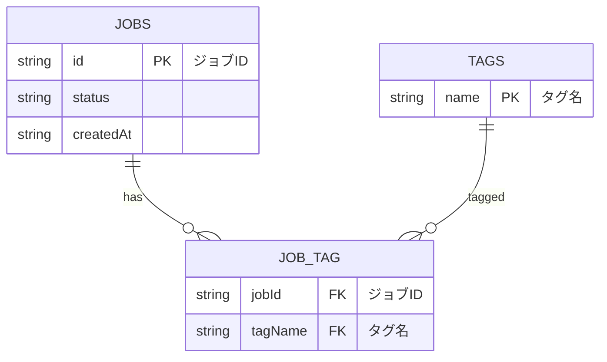

# エグゼクティブサマリ  
本設計では、ローカルファーストな長時間実行分析ジョブの管理に必要最小限のREST APIを定義する。エンドポイントとしては、ジョブ作成、ジョブ取得・一覧、ジョブ削除（キャンセル）、ログ取得・ストリーミング、タグ操作などを想定する。各エンドポイントはHTTPメソッド・パス・目的とともにJSON Schemaを用いて入出力フォーマットを厳密に定義し、例示を示す。  
ジョブの状態更新・ログ配信には、ポーリング・サーバ送信イベント（SSE）・WebSocketの各手法を比較検討する。レイテンシや実装複雑度、再接続、順序保証、多重化、ブラウザ/プロキシ対応、オフライン対応などで比較表を示す。  
ログ取得エンドポイントにはHTTPキャッシュ機構を活用する。具体的には、RFC7232のETagとIf-None-Matchによる条件付きGETや、RFC7233のRange/If-Rangeによる部分取得を検討する。クライアント側は前回取得時のETagを送信し、サーバは変更がなければ304 Not Modifiedで応答する【11†L783-L792】。差分取得にはRangeリクエストも併用可能である【15†L49-L53】。レスポンス例のJSON Schemaには`entries`（ログ行）と次回用`nextToken`などを含め、ETagはHTTPヘッダで付与する。  
タグ機能（Tagmetry）は当初、ジョブリソースに文字列配列で保持し、`GET/POST/DELETE /jobs/{id}/tags`で操作する簡易設計とする。将来スケールさせる場合は、タグ→ジョブIDの逆引き（インバーテッドインデックス）を別途構築し、最終的には分散検索エンジンやCRDTを用いたタグ同期へ移行する道筋を示す。これら設計にはRFC等正規仕様を参照し、可能な限り正式出典を引用した。  

## REST APIエンドポイント一覧  
- **POST /jobs** – 新規ジョブ作成。リクエストボディで分析パラメータや初期タグ（文字列配列）を受け取り、ジョブを投入する。認証は想定せず（ローカルツール向け）。レスポンスは`201 Created`で、`Location`ヘッダに作成したジョブURIを含め、ボディにジョブオブジェクトを返す【37†L2961-L2969】。非同期処理を強調する場合は`202 Accepted`も可【37†L2977-L2985】。  
  - **Request Schema (JSON)**:  
    ```json
    {
      "$schema": "http://json-schema.org/draft-07/schema#",
      "type": "object",
      "properties": {
        "parameters": { "type": "object" },
        "tags": {
          "type": "array",
          "items": { "type": "string" }
        }
      },
      "required": ["parameters"]
    }
    ```
    **Example**:  
    ```
    POST /jobs
    {
      "parameters": {"input":"data.csv","mode":"fast"},
      "tags": ["urgent","test"]
    }
    ```  
  - **Response Schema (201 Created)**:  
    ```json
    {
      "$schema": "http://json-schema.org/draft-07/schema#",
      "type": "object",
      "properties": {
        "id": {"type": "string", "description": "ジョブID（UUIDなど）"},
        "status": {
          "type": "string",
          "enum": ["pending","running","completed","failed","canceled"]
        },
        "createdAt": {"type": "string", "format": "date-time"},
        "startedAt":  {"type": ["string","null"], "format": "date-time"},
        "completedAt": {"type": ["string","null"], "format": "date-time"},
        "tags": {"type": "array", "items": {"type": "string"}}
      },
      "required": ["id","status","createdAt"]
    }
    ```  
    **Example**:  
    ```
    HTTP/1.1 201 Created
    Location: /jobs/123e4567-e89b-12d3-a456-426614174000
    {
      "id": "123e4567-e89b-12d3-a456-426614174000",
      "status": "pending",
      "createdAt": "2026-02-18T12:00:00Z",
      "tags": ["urgent","test"]
    }
    ```  

- **GET /jobs/{id}** – 指定IDのジョブ情報取得（ステータスや作成日時など）。認証なし。レスポンスは200 OKでジョブオブジェクト（上記スキーマ）。  
  **Example**:  
  ```
  GET /jobs/123e4567-e89b-12d3-a456-426614174000
  HTTP/1.1 200 OK
  {
    "id": "123e4567-e89b-12d3-a456-426614174000",
    "status": "running",
    "createdAt": "2026-02-18T12:00:00Z",
    "startedAt": "2026-02-18T12:01:00Z",
    "tags": ["urgent","test"]
  }
  ```  

- **GET /jobs** – ジョブ一覧取得。認証なし。クエリパラメータ例: `?tag=xxx` でタグフィルタ可能。レスポンスは以下のようにジョブ配列を返すJSON。  
  - **Response Schema**:  
    ```json
    {
      "$schema": "http://json-schema.org/draft-07/schema#",
      "type": "object",
      "properties": {
        "jobs": {
          "type": "array",
          "items": { /* 前述のジョブオブジェクト */ }
        },
        "nextToken": {"type":"string"}
      },
      "required": ["jobs"]
    }
    ```  
    **Example**:  
    ```
    GET /jobs?tag=urgent
    HTTP/1.1 200 OK
    {
      "jobs": [
        {"id":"...","status":"completed","createdAt":"...","completedAt":"...","tags":["urgent"]},
        {"id":"...","status":"running","createdAt":"...","startedAt":"...","tags":["urgent","data"]}
      ]
    }
    ```  

- **DELETE /jobs/{id}** – ジョブ停止/削除（キャンセル）。認証なし。成功時に`204 No Content`を返す（ジョブが存在しない場合も204）。  

- **GET /jobs/{id}/logs** – ジョブのログ取得。認証なし。レスポンスはJSON形式で、`entries`にタイムスタンプ付きログ行の配列を格納し（順序付き）、`nextToken`に次回取得用トークンを返す設計とする。HTTPヘッダにETagを付与し、`If-None-Match`による条件付きGETで効率化可能【11†L783-L792】。  
  - **Response Schema (200 OK)**:  
    ```json
    {
      "$schema": "http://json-schema.org/draft-07/schema#",
      "type": "object",
      "properties": {
        "entries": {
          "type": "array",
          "items": {
            "type": "object",
            "properties": {
              "timestamp": {"type": "string", "format": "date-time"},
              "message": {"type": "string"}
            },
            "required": ["timestamp","message"]
          }
        },
        "nextToken": {"type":"string"}
      },
      "required": ["entries"]
    }
    ```  
    **Example**:  
    ```
    GET /jobs/123e4567-e89b-12d3-a456-426614174000/logs
    If-None-Match: "etag-xyz"
    HTTP/1.1 304 Not Modified

    GET /jobs/123e4567-e89b-12d3-a456-426614174000/logs
    HTTP/1.1 200 OK
    ETag: "etag-abc"
    {
      "entries": [
        {"timestamp":"2026-02-18T12:00:01Z","message":"Start analysis."},
        {"timestamp":"2026-02-18T12:00:05Z","message":"Step 1 complete."}
      ],
      "nextToken": "tkn-001"
    }
    ```  

- **GET /jobs/{id}/logs/stream** – ログストリーミング（SSE）。`Accept: text/event-stream`で接続。レスポンスは`Content-Type: text/event-stream`で各ログ行を`data:`プレフィックス付きのイベントとしてリアルタイム送信する。例:  
  ```
  event: logEntry
  data: {"timestamp":"2026-02-18T12:00:10Z","message":"Step 2 complete."}

  event: logEntry
  data: {"timestamp":"2026-02-18T12:00:20Z","message":"Step 3 complete."}
  ```  

- **WebSocket** (任意) – `ws://<host>/jobs/{id}/ws`などで接続し、双方向チャネルでステータス・ログを送受信可能。HTTP Upgradeハンドシェイクが必要で、プロキシ越えなどで注意が要る【21†L55-L62】【40†L66-L74】。  

- **GET /jobs/{id}/tags** – ジョブに付与されたタグ一覧取得。認証なし。レスポンスは文字列配列。  
  **Example**:  
  ```
  GET /jobs/1234/tags
  HTTP/1.1 200 OK
  ["urgent","data"]
  ```  

- **POST /jobs/{id}/tags** – ジョブへのタグ追加。ボディに`{"tag":"タグ名"}`を受け取り、ジョブにタグを付与する。レスポンス例として更新後のタグ一覧（文字列配列）を返すか、204 No Contentでもよい。  
  **Request Schema**:  
  ```json
  {
    "$schema": "http://json-schema.org/draft-07/schema#",
    "type": "object",
    "properties": {
      "tag": {"type": "string"}
    },
    "required": ["tag"]
  }
  ```  
  **Example**:  
  ```
  POST /jobs/1234/tags
  {
    "tag": "analysis"
  }
  HTTP/1.1 200 OK
  ["urgent","data","analysis"]
  ```  

- **DELETE /jobs/{id}/tags/{tag}** – ジョブから指定タグを削除。認証なし。成功時は204 No Content。  

- **GET /jobs?tag=タグ名** – タグでフィルタしたジョブ一覧取得。`GET /jobs`と同様の形式で、クエリ`tag`で指定タグを含むジョブのみを返す。  

## ポーリング vs SSE vs WebSocket の比較  
ログやステータス更新の取得手法として、以下のように比較する:

| 項目             | ポーリング                    | SSE (Server-Sent Events)           | WebSocket                    |
|--------------|-----------------------------|------------------------------------|-----------------------------|
| **レイテンシ**     | 高い（ポーリング間隔依存、低頻度では遅延）         | 低い（サーバが発生時に即プッシュ）【9†L59-L67】    | 低い（サーバ・クライアント間で即時送受信）【40†L66-L74】 |
| **実装の複雑さ**  | 低い（単純HTTP GETの繰り返し）               | 中程度（HTTPストリームを開いてイベント形式で送信）    | 高い（ハンドシェイクとメッセージフレーミングが必要）【21†L55-L62】 |
| **再接続**       | 自明（次回の定期取得で自然にリトライ）         | 自動（`EventSource` が切断時に自動再接続、Last-Event-IDで再開可能【9†L147-L150】）  | 手動（アプリ側で切断検知と再接続実装が必要） |
| **順序保証**     | 相対的（各レスポンスは都度独立だが通常FIFO）    | 保証あり（イベントは送信順で受信）         | 保証あり（1コネクション内のフレームは順序通り） |
| **多重化**       | 複数エンドポイントは別々にポーリング           | 1接続につき1ストリーム。イベント種類で疑似多重化可能  | 1接続で多目的利用可能。アプリ層でサブプロトコルやメッセージタイプで識別可 |
| **ブラウザ対応**  | 全ブラウザ対応                       | 大部分対応（Chromium/Firefox/SafariではOK、IE系非対応）   | 広く対応（すべての現代ブラウザでサポート） |
| **プロキシ対応**  | HTTPなので問題なし                       | HTTP長時間接続扱い。特殊な処理不要で多くのプロキシ通過【9†L67-L70】  | Upgradeが必要なため、一部プロキシ/ファイアウォールでブロックされる場合あり |
| **オフライン対応** | クライアントキャッシュや再試行で柔軟（接続不要時は停止可能） | 接続が必須。オフライン時は切断になり、再接続を試行するのみ。 | 接続が必須。オフラインでは接続不可（再接続ロジックのみ可能） |

- **ポーリング**は実装が簡易で、オフライン時は再試行等で柔軟に対応可能だが、定期取得間隔に応じてレイテンシが増大する。  
- **SSE**は一方通行のリアルタイム更新に特化した方式で、`text/event-stream`のHTTP接続でサーバから逐次送信するため低レイテンシ。特別なプロトコルアップグレードを不要とし【9†L67-L70】、多くのプロキシ／ロードバランサでHTTP接続と同様に扱われる。ただしHTTP/1.1ではブラウザごとに同時6接続制限がある【7†L290-L297】。EventSource APIはデフォルトで切断時に自動再接続し、再接続時に`Last-Event-ID`ヘッダで続きから受け取れる【9†L147-L150】。  
- **WebSocket**は双方向通信チャネルで、サーバとクライアント間でいつでもメッセージ交換可能な点が利点【40†L66-L74】。ただし最初にHTTPアップグレードのハンドシェイクが必要で実装が複雑【21†L55-L62】。一つのソケットで多様なメッセージ送受信ができる（多重化可能）一方、既存HTTPプロキシではアップグレードを許可しない場合もある。  
  
各方式の選択はユースケース次第だが、ローカルファーストの文脈では常時接続を要するSSE/WSはオフライン時に未対応となる一方、ポーリングはオフラインでも停止・再開しやすい利点がある。

## ログエンドポイントのキャッシュ・条件付きリクエスト戦略  
ジョブログを効率的に取得するために、HTTPキャッシュ機構を活用する。サーバはログリソースに対して**ETag**ヘッダ（ログ内容のハッシュやバージョン識別子）を付与し、クライアントは前回取得時のETagを`If-None-Match`ヘッダで送信する。サーバはログ更新がなければ**304 Not Modified**を返し、通信量を削減できる【11†L783-L792】。  
また、RFC7233の**Range**リクエストをサポートすれば、過去取得済みのログを飛ばして末尾のみ取得できる（バイト範囲指定）。この場合、`If-Range`ヘッダに既知のETagを含めると、ETag一致時のみ範囲レスポンス（206）が返され、ETag不一致時は全体（200）が返される【15†L49-L53】。ただし範囲指定はバイト単位のため、行単位の再取得には工夫が必要である。  
独自方式として、レスポンスに**nextToken**（前回ログ末尾のトークン）を含め、クライアントが`?sinceToken=...`のように指定して新規エントリのみ取得する方法も有効である。追加データがなければ空配列を返すことでノイズを減らせる。  

上記を踏まえ、ログ取得エンドポイントのJSONスキーマ例を以下に示す。ETagはHTTPヘッダで扱うためスキーマには含めず、ボディのみ定義する。  
```json
{
  "$schema": "http://json-schema.org/draft-07/schema#",
  "type": "object",
  "properties": {
    "entries": {
      "type": "array",
      "items": {
        "type": "object",
        "properties": {
          "timestamp": {"type": "string", "format": "date-time"},
          "message": {"type": "string"}
        },
        "required": ["timestamp","message"]
      }
    },
    "nextToken": {"type":"string"}
  },
  "required": ["entries"]
}
```  
**例:**  
```
GET /jobs/1/logs
If-None-Match: "etag-old"
HTTP/1.1 304 Not Modified

GET /jobs/1/logs
HTTP/1.1 200 OK
ETag: "etag-new"
{
  "entries": [
    {"timestamp":"2026-02-18T12:01:00Z","message":"Step 2 complete."}
  ],
  "nextToken": "token456"
}
```  
上記例ではETag一致時に304、差分取得時に200＋新データを返している。  


## タグ機能 (Tagmetry) の設計とマイグレーション  

タグはジョブに任意の文字列で付与可能な機能とする。最初はジョブリソース自身に文字列配列で保持し、以下のエンドポイントで操作する単純モデルとする。  

- **GET /jobs/{id}/tags** – 当該ジョブのタグ一覧取得（文字列配列）。  
- **POST /jobs/{id}/tags** – ジョブへタグ追加。`{"tag":"文字列"}`をリクエストし、指定タグを追加する。  
- **DELETE /jobs/{id}/tags/{tag}** – ジョブから指定タグ削除。  

クライアントはこれらでタグ付け・解除を行い、結果を`GET /jobs/{id}`などで確認できる。現状は完全整合的に扱い、タグ操作はジョブ単位の小トランザクションで解決できる。  

**拡張性:** タグ数やジョブ数が膨大になると、タグでジョブ検索する際に全スキャンになる問題がある。これを解決するため、**タグ→ジョブIDの逆引きインデックス**を別テーブルやキャッシュに持たせる方法がある。すなわち、各タグに紐づくジョブIDリストを管理し、`GET /jobs?tag=...`クエリ時はこのインデックスを参照する。インデックス更新はタグの追加/削除時に行う（例: DBの複合インデックス、あるいは専用のタグテーブル）。その後、より大規模運用では外部検索エンジン（Elasticsearch等）やCRDTを用いた分散同期を導入する道がある。  

以下に簡易実装からスケール対応への移行ステップ例を示す。

| ステップ       | データモデル・機能                                 | 説明 |
|------------|--------------------------------------------|-----|
| 1. シンプル実装    | ジョブテーブルにタグ文字列配列を保持                  | タグはジョブリソースのフィールド（例: JSONB）として扱う。タグ追加/削除APIは単純にこの配列を更新する。検索は全行スキャン(またはDBのネイティブインデックス)で実現。 |
| 2. セカンダリインデックス導入 | タグ→ジョブIDのマッピングテーブルを追加             | タグごとにジョブIDを保持する中間テーブル(例: `job_tags(job_id, tag)` )を持ち、インデックスを貼る。これにより`tag='xxx'`のクエリが高速になる。タグ操作時には中間テーブルも更新する。可能なら非同期にインデックス更新し整合性緩める。|
| 3. 分散・最適化     | 分散検索エンジンやCRDTによるタグストアに移行            | 大規模クラスター向けにElasticsearchやソーシャルタグ共有のような逆引きDBを採用。CRDTセットでタグ同期し、レプリケーションによる最終的整合性で運用。タグ検索は外部サービスへオフロード。 |
  

上図はステップ2の例として、ジョブ(`JOBS`)とタグ(`TAGS`)の多対多関係を表している。実運用では最初は`TAGS`テーブルなしで、各ジョブにタグ配列を持たせた単純モデルから始め、必要に応じて右側のように中間テーブルを増やしていく形で拡張する。  

## 参考資料  
- HTTP/1.1 条件付きリクエスト（ETag, If-None-Match, Range） – RFC7232/RFC7233【11†L783-L792】【15†L49-L53】  
- Server-Sent Events 仕様 – WHATWG HTML標準およびブラウザ実装【9†L59-L67】【9†L67-L70】  
- WebSocket 仕様 – RFC 6455【40†L66-L74】【21†L55-L62】  
- HTTPステータスコード（201 Created, 202 Accepted） – RFC7231【37†L2961-L2969】【37†L2977-L2985】  

