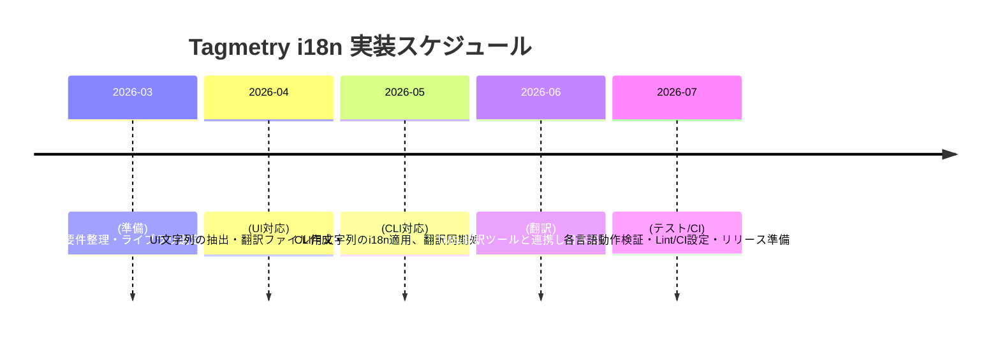

# Executive Summary  
英語中心の開発を維持しつつ、将来の日本語対応を容易にするためには、単純かつ構造化されたi18n方式が重要です。具体的には、**意味を持つキー (Structured Keys)** を用いた文字列管理を推奨し、ランタイムでは翻訳辞書を参照する仕組みとします【4†L78-L86】【17†L571-L574】。キー設計では画面名や機能名で名前空間化し、衝突を避けます。また、翻訳が未整備の場合は英語（デフォルト言語）をフォールバックとして表示し、ユーザー体験を保ちます【18†L7-L10】【44†L280-L288】。ファイル形式は、シンプルで広くサポートされる**JSON**形式をベースに検討します（必要に応じてYAMLやICUフォーマットも考慮）【21†L75-L83】【24†L292-L300】。エラーメッセージやログは開発者向けとユーザー向けで分離し、ログは原文（英語）のままとしておくのが一般的です【34†L138-L146】【38†L463-L472】。以下で、小規模ウェブUI＋CLIアプリ向けに具体的なアーキテクチャやファイル構成例、翻訳運用方針、Tagmetryプロジェクト向け実装計画を詳述します。

## 1. i18nアーキテクチャ案  
- **文字列テーブルとキー設計**：翻訳リソースは各言語ごとの辞書ファイル（例：`en.json`, `ja.json`）で管理し、キーによって文言を識別します。キーは意味や文脈を含む構造化キー（例：`Home.Title`）を用いると変更耐性が高くなります【4†L78-L86】【17†L571-L574】。逆に英語文そのものをキーにする手法（Content-as-Key）は、文言変更時に多大な影響が生じるため注意が必要です【4†L78-L86】。キー命名は短すぎず長すぎず、「画面.項目」のようにグループ化して付けると管理しやすくなります【17†L571-L574】。  
- **フォールバック戦略**：ユーザーの言語リソースが無い場合や訳文が欠けている場合、英語（デフォルト）をフォールバック言語として表示します【18†L7-L10】【44†L280-L288】。i18nextなどのライブラリでは `fallbackLng: 'en'` と設定する例が一般的です【44†L280-L288】。また、方言（例：`en-GB`→`en`）の自動フォールバックも設定できます【6†L93-L102】。複数名前空間を使う場合は、名前空間間でもフォールバック可能です。キーそのものをフォールバック値とする手法は一応可能ですが、管理が煩雑になるため注意が必要です【6†L199-L207】。  
- **実行時ルックアップ**：実行時にキーから翻訳を取得する方法として、例えばJavaScriptではi18nextのようなライブラリを利用します。UIコンポーネントやサービス内でキーを指定して翻訳文字列を取得し、画面に表示します【17†L589-L598】【17†L599-L608】。CLIでも同様にライブラリ（例：npmの `i18n` モジュール）を用いてキー→文言を変換できます【50†L280-L289】【50†L333-L342】。パフォーマンス的には、小規模アプリでは一度ロードする翻訳ファイルサイズの影響が主なので、1言語1ファイル程度なら問題ありません【17†L579-L583】。より大規模になれば、ファイル分割や遅延読み込みを検討します。  
- **複数形と補間 (Plural & Interpolation)**：言語ごとに複数形規則は異なります。英語なら単数形 (`_one`)・複数形 (`_other`) などを定義しますが、日本語は複数形がないので単一の表現で問題ありません。i18nextでは例としてキー`item_one`, `item_other`の形式で定義し、`count`パラメータで自動選択します【7†L123-L132】【7†L139-L143】。動的パラメータは`{{name}}`のようなプレースホルダで埋め、取得時に値を差し込みます【10†L103-L112】【10†L115-L123】。なお、デフォルトでHTMLエスケープされるためXSS対策も考慮されます【10†L75-L83】。複雑な場合はICU MessageFormatを使い、 `{count, plural, one {...} other {...}}` 構文を利用すると柔軟ですが、ライブラリの対応状況を確認する必要があります【27†L79-L87】。  
- **文脈 (Context)**：性別や丁寧度など文脈によって訳語を変えたい場合、i18nextの`context`機能などを使います【11†L75-L83】【11†L95-L103】。例えば、`t('friend', {context:'male'})` のように呼び出せば`friend_male`キーが使われます。日本語では性別表現が少ないものの、敬称や名詞・動詞の使い分けには役立つことがあります。  
- **パフォーマンス上の考慮**：小規模アプリでは重いライブラリの導入は避けたいものの、i18nの実行時処理は通常、初回ロード時のファイル読み込み・パースが主なコストです。JSONファイルによる翻訳ロードは軽量なので安心ですが、必要以上に複雑なランタイム解析（例：ネストされた関数マクロ等）は控えます。ReactやAngularのような環境なら、Tree-shaking効率のよいライブラリやコンパイル時変換（LinguiのBabelマクロなど）も検討できますが、まずは単純明快な仕組みを優先します。  

## 2. ファイル形式とフォルダ構成  
翻訳データのフォーマットには多様な選択肢があります。以下に主な形式の特徴をまとめます。

| 形式              | 拡張子    | 特徴                                | 長所                                     | 短所                                    |
|:-----------------|:---------|:-----------------------------------|:----------------------------------------|:---------------------------------------|
| **JSON**         | `.json`  | JavaScript Object Notation。構造が厳格で高速解析【21†L75-L83】。          | ほぼすべての言語・ライブラリでサポート、パースが軽量、高速【21†L75-L83】。 | コメント不可、改行は`\n`でエスケープ必要【21†L75-L83】。           |
| **YAML**         | `.yml`   | 人間向け。インデントベース、コメントや複数行文字列をサポート【21†L75-L83】。| 読みやすくコメントが書ける【21†L75-L83】。マルチラインやアンカー機能有【21†L133-L142】。 | パーサーが重く、インデントミスで壊れやすい【21†L133-L142】。スキーマ検証は弱い【21†L133-L142】。 |
| **PO/POT**       | `.po`,`.pot` | gettext形式。テンプレート(POT)と翻訳(PO)に分ける【24†L292-L300】。    | 翻訳者に馴染み深く、コメント・文脈・フラグ・複数形規則など豊富なメタデータを含められる【24†L292-L300】。堅牢な翻訳ワークフローを提供。 | フォーマットが複雑でビルドが重くなる。JavaScript環境では導入がやや煩雑（PO→MOコンパイルなど）。 |
| **ICU MessageFormat** | 組み込み形式   | `{count, plural, ...}` など変数挿入・複雑な文法を1文字列で表現【27†L79-L87】。 | 多言語の複数形・性別など高度な変換が可能【27†L79-L87】。多くのライブラリ（FormatJS、i18next-icu、Linguiなど）が対応【27†L131-L139】。 | 書式が難解で手動編集が難しい。使用可能なライブラリが限られることも。JSON/YAMLの値として含めるのが一般的。 |
| **JS/TS モジュール** | `.js`/`.ts` | 直接コードで翻訳辞書を定義（`export const en = {...}` など）。型チェック可能【31†L237-L246】。 | 静的に翻訳をバンドルできるためビルド時に最適化（Tree Shaking）できる。TypeScriptで型安全に管理可能【31†L237-L246】。 | 翻訳者が直接編集しにくい（開発者向け）。ビルドが必要で、リアルタイム切替には不向き。 |

**推奨フォーマット：** 小規模・迅速性重視のため、まずは**JSON**形式を主軸とします。JSONはフロントエンドで扱いやすく、VSCodeなどのエディタで編集しやすい【17†L571-L574】【21†L75-L83】。必要に応じてコメントを付けたい場合や、長い文章（メール本文など）が多い場合はYAMLを検討しますが、初期はJSONで始めるのが無難です【21†L75-L83】【21†L133-L142】。複数形や条件分岐が複雑な部分にはICU構文を使った別キー（またはJSON値内にICU文法）にして対応します。gettext（PO）はワークフローが重いため、JS/TSベースのアプリでは後段検討、CLIのPython実装など他言語時に限定してもよいでしょう【24†L292-L300】。

**フォルダ構成例（Web UI & CLI）:**  
- `src/i18n/` – 翻訳関連ソース  
  - `locales/` – 言語別フォルダ  
    - `en.json`, `ja.json` – 翻訳辞書（各キーとテキスト）【17†L571-L574】  
    - 例：`en.json`  
      ```json
      {
        "HOME": {
          "TITLE": "Welcome to our site!",
          "DESCRIPTION": "This is a sample application."
        },
        "LOGIN": {
          "USERNAME": "Username",
          "PASSWORD": "Password",
          "BUTTON": "Log In"
        }
      }
      ```  
    - `ja.json`  
      ```json
      {
        "HOME": {
          "TITLE": "私たちのサイトへようこそ！",
          "DESCRIPTION": "これはサンプルアプリケーションです。"
        },
        "LOGIN": {
          "USERNAME": "ユーザー名",
          "PASSWORD": "パスワード",
          "BUTTON": "ログイン"
        }
      }
      ```  
    - **ポイント：** 上記のようにキー階層を画面名などでグループ化すると管理しやすい【17†L571-L574】。  
  - `i18n.config.ts` – i18nextなどの初期設定ファイル  
  - `i18n-loader.ts` – 翻訳ファイルのロード・初期化処理  
  - `strings.ts` – 翻訳キーの定義（必要ならenumなどでキーを型管理）【31†L237-L246】  
- `src/cli/` – CLI実装  
  - `locales/` – CLI用翻訳フォルダ（英語・日本語）  
    - `en.json`, `ja.json` – CLI文言を含む辞書  
  - `i18n.ts` – CLI側のi18n設定（例：`i18n.configure`）【50†L280-L289】  

この構成なら、UI・CLIとも同一キー体系で文言管理できます。翻訳ファイルは初め英語を作成し、それを元に他言語ファイルを作成・翻訳する手順がシンプルです【17†L571-L579】。

## 3. エラー文言・ログ・翻訳運用ガイド  
- **ユーザー向け vs 開発者向け文言の分離**：画面表示用の文言（メニュー、ボタン、エラー通知など）は翻訳対象に含めます。一方、ログや例外メッセージなど開発者向けの内部メッセージは原則として英語（開発言語）のままとし、i18n対象から外します【34†L138-L146】【38†L463-L472】。例えば、`console.error("デバッグ用メッセージ...")`のようなコードは`translate`経由せず固定文字列に留めます【38†L463-L472】。ログを翻訳すると、サポートチームが多言語対応するコストが増え、逆に混乱を招く恐れがあります【34†L138-L146】【38†L463-L472】。  
- **エラーメッセージの扱い**：ユーザーに表示されるエラーやバリデーション文は必ず翻訳し、ユーザー言語で表示します【34†L138-L146】。CLIのエラー出力もユーザー視点で必要なら翻訳しますが、ログに詳細情報（英語エラーナンバーなど）を併記しておくと調査が容易です【34†L138-L146】。  
- **翻訳者向けポリシー**：翻訳者には次のように伝えます。プレースホルダ（`{{name}}`等）やHTMLタグなどは必ずそのまま保持すること（例：`Hello {{name}}!`→「こんにちは、{{name}}さん！」）。略語や専門用語の統一には注意し、必要に応じて用語集を共有します。また、文脈が不足しないようキー名やコメントで説明を付与するか、適切な訳注を用意します【21†L151-L159】【27†L172-L181】。CLIでは英語がデフォルトなので、UIに比べて厳密さはやや緩和できますが、間違った箇所があれば後日修正できる仕組み（例：TMSとの同期やCIチェック）を設けます。  
- **ランタイムの言語切替**：ウェブUIではユーザーが言語を選べる場合、言語切替機能を実装します（例：i18nextの `use('ja')` ）。Angular/ngx-translateなら `setDefaultLang('en')` と `use('ja')` で動的切替が可能です【18†L12-L14】。CLIでは起動時に環境変数や引数で言語を指定する形が一般的です。開発やQA用には擬似ローカライズモード（文字を伸ばすなどのツール）や、必要なら翻訳を無効化して英語表示に切り替えるフラグも準備すると便利です。  

## 4. Tagmetry向け実装計画  
Tagmetryプロジェクトでの最小実装ステップと工数目安、ツール・チェック項目などを以下に示します。

### タスク一覧・工数  
1. **要件定義・ツール選定** (小)：既存コードの文字列抽出、i18nライブラリの選定（例：i18next、FormatJSなど）、フォルダ構造設計を行う。  
2. **UI翻訳ファイル準備** (小)：英語のリソースファイル（例：`src/i18n/locales/en.json`）を作成し、既存UIのハードコーディング文字列をキー参照に置換する。キー命名規則をドキュメント化【17†L571-L574】【38†L463-L472】。  
3. **i18nライブラリ導入** (小)：フロントエンドにi18n設定を組み込み、`t('KEY')` で翻訳取得できることを確認。デフォルト言語を英語、フォールバックも英語に設定【44†L280-L288】【18†L7-L10】。ランタイム言語切替機能も実装する。  
4. **CLIへの適用** (中)：CLIツール側（NodeまたはPython）に同様のi18n仕組みを導入する。Nodeであれば `i18n` モジュールを用い、`i18n.configure({locales:['en','ja'],directory:'locales',defaultLocale:'en'})` と設定【50†L280-L289】。翻訳ファイル（`cli/locales/en.json` 等）を用意し、CLI出力を翻訳キーから生成する。  
5. **翻訳ワークフロー整備** (中)：新規キー追加の抽出スクリプト（e.g. `xgettext` か i18next-scanner）や、Lintルール（未翻訳キー検出）を導入。CIで翻訳ファイルの変更をチェックし、デフォルト言語キーとの整合性検証を行う。翻訳者向けに文脈説明や用語集も準備する。  
6. **日本語翻訳作業** (中)：英語ファイルをベースに日本語訳を実施し、翻訳品質を確認する。クラウドTMSや翻訳メモリを利用できれば効率化できる。  
7. **テスト・リリース準備** (中)：言語切替テスト、UI/CLI正常動作の確認、不足翻訳のリストアップを行う。問題なければマージ・デプロイする。  

各タスクの**規模感**は小～中規模であり、1～2週間程度で実施可能と見積もります。以下の**比較表**も参照してください。

### 比較表：翻訳ファイル形式・ライブラリ  
| 項目             | 選択肢                   | 長所                                       | 短所                                      |
|:----------------|:-----------------------|:------------------------------------------|:-----------------------------------------|
| **フォーマット** | JSON/YAML/PO/ICU/TS    | 上述のとおり【21†L75-L83】【24†L292-L300】  | －                                        |
| **ライブラリ (Web)** | i18next+react-i18next | 広汎なサポート、多機能・プラグイン充実【44†L280-L288】。TypeScript対応。 | サイズやランタイムコストやや大。設定学習コスト。|
|                  | FormatJS (react-intl)  | ICUフォーマット標準対応、リッチ。           | React特化、いくつか設定が複雑。            |
|                  | LinguiJS               | Babelマクロで型安全に組み込み可【27†L131-L139】。 | 翻訳抽出の学習コストあり。                |
| **ライブラリ (CLI)** | i18n (Node)            | シンプル設定でJSON生成、自動出力【50†L280-L289】【50†L333-L342】。 | 機能は限定的。                             |
|                  | gettext (Python)       | 翻訳者向けワークフロー強力【24†L292-L300】。 | PO→MOなどビルド要。                      |
|                  | 自前実装              | 軽量かつ必要最小限。                        | 再利用性・機能は自作次第。                 |

### Tagmetry 実装スケジュール例（概略）  


以上の計画で進めれば、Tagmetryプロジェクトは英語中心開発を維持しつつ、段階的に多言語対応を実現できます。実装後はCIで未翻訳検出や翻訳差分チェックを行い、継続的に品質を担保します。

**参考文献:** 公式ドキュメントやベストプラクティスを中心に引用しました【4†L78-L86】【6†L199-L207】【7†L123-L132】【10†L75-L83】【11†L75-L83】【17†L571-L579】【18†L7-L10】【21†L75-L83】【24†L292-L300】【34†L138-L146】【38†L463-L472】【44†L280-L288】【50†L280-L289】など。各種比較情報は上記資料より抜粋・要約しています。  

