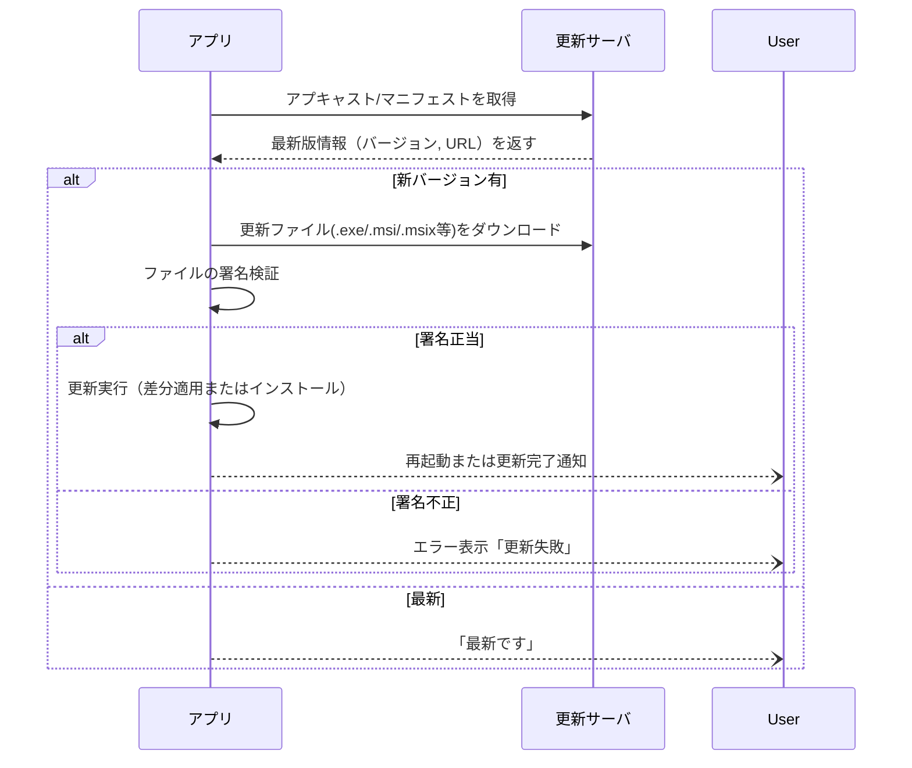
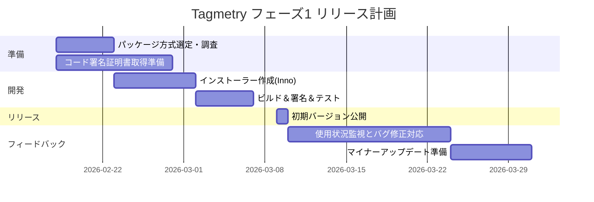

# エグゼクティブサマリー  
Windows向け有償開発ツールの配布には、**シングルファイル化**と**コード署名**が重要です。シンプルなEXE配布（またはポータブルEXE）によりインストール不要で配布が容易ですが、依存関係や更新機能は自前で実装する必要があります。一方、**MSI**や**MSIX**パッケージはアンインストール・修復機能や企業向け導入機能を備え、**MSIX**は自動更新やコンテナ化など最新機能を持ちますが、Windows 10/11以降限定で導入コストがかかります。**Inno Setup/NSIS**のような無料インストーラはシングルEXE出力で手軽ですが、エンタープライズ環境ではMSIが推奨されます【27†L332-L339】【27†L343-L345】。また、Squirrel.WindowsやWinSparkle（Sparkleライク）の組み込み更新機構も検討対象です【3†L326-L333】【33†L14-L22】。

コード署名は**必須**であり、Windows SmartScreenフィルタの警告を軽減します。標準（OV）証明書は安価ですが、ソフトウェアの実行実績（ダウンロード数など）に応じて数週間～数ヶ月かけて評価が蓄積される必要があります【43†L333-L341】【43†L375-L383】。EV署名証明書は従来「即時評価」で警告回避を助けていましたが、2024年以降はEVでも評価期間が必要になっています【43†L454-L459】【37†L142-L149】。署名時には**タイムスタンプ**を付与し、証明書更新後も署名時点の信頼を維持することが重要です【37†L90-L98】【43†L366-L369】。 

アップデート方式としては、Squirrel.Windows（差分更新対応）やWinSparkle（XMLアプキャスト）などのライブラリが有用です【3†L326-L333】【33†L14-L22】。いずれもHTTPS経由で配信し、ダウンロード後に必ず署名検証を行います【42†L353-L357】。MSIXの場合はWindowsの**AppInstaller**機能を使い自動差分更新が可能です【45†L283-L290】。GitHub Releasesや自前サーバ＋CDNも選択肢ですが、その場合は更新スクリプトの実装が必要です。更新時は差分配信で帯域節約できる一方、失敗時のロールバック設計も検討します。

サポート性を高めるため、**クラッシュレポート**や**テレメトリ**導入が望ましいです。Microsoft App CenterやAzure Application Insightsはビルド・配布・クラッシュ収集・解析まで一元的に提供します【23†L104-L112】【46†L47-L55】。インストーラのログ取得やサイレントインストール対応も企業要件として考慮します。以上を踏まえ、以下にパッケージ方式比較表、SmartScreen・署名詳細、更新戦略、軽量更新ライブラリの比較、ならびにTagmetryのフェーズ1リリース計画を示します。

## パッケージ方式の比較  

| 配布方式                  | 単一ファイル対応 | SmartScreen影響                 | 署名要/利点                | 更新サポート        | 実装容易度        | コスト        | 企業適合性        |
| ------------------------- | :-------------: | :-----------------------------: | :-------------------------: | :-----------------: | :--------------: | :-----------: | :--------------: |
| 単一EXE（自己完結型）     | 対応（Exeのみ）  | 未署名では警告。署名で警告軽減   | 署名すると信頼性向上        | なし（自前実装）   | 非常に高（簡単）  | 無料           | ×（展開不可）     |
| ポータブルEXE             | 対応            | 単一EXEと同様                   | 単一EXEと同様                | なし（自前実装）   | 高               | 無料           | ×（展開不可）     |
| Inno Setup（インストーラEXE） | 対応         | 未署名時警告。署名推奨【27†L332-L339】 | 署名でユーザー信頼獲得      | なし（追加実装）   | 中（スクリプト要） | 無料（OSS）    | △（管理機能弱）   |
| NSIS（インストーラEXE）   | 対応            | Innoと同様                     | 署名で信頼性向上             | なし（追加実装）   | 中（スクリプト要） | 無料（OSS）    | ×（管理機能弱）   |
| MSI（Windows Installer）  | 対応            | 署名推奨（企業環境標準）【27†L283-L285】 | 署名で企業配布が容易に      | なし（WSUS等で代替）| 低（WiX学習要）    | 無料           | ◎（WSUS/AD対応） |
| MSIX/Appx（コンテナ型）   | 実質対応（ZIP系）| 署名**必須**【21†L226-L233】            | 署名必須で自動更新・巻戻し可 | あり（AppInstaller経由）【21†L226-L234】 | 低（専用ツール必須） | 無料           | ◎（Intune対応）  |
| Squirrel.Windows          | 対応（インストーラEXE）| 未署名警告。署名で軽減   | 署名でSmartScreen向上       | あり（自動差分・Silent）【3†L326-L333】 | 中               | 無料（OSS）    | △（ユーザーレベル） |
| WinSparkle（Sparkle類似） | 対応（アプリ組込） | 未署名警告。署名で軽減   | 署名で更新信頼性確保        | あり（アプキャストXML）【33†L14-L22】 | 中（DLL組込）    | 無料（OSS）    | ×（企業非標準）   |
| Chocolatey                 | –              | セキュリティスクリプト経由     | **パッケージ単位で署名必須** | あり（`choco upgrade`） | 低（パッケージ作成） | 無料（OSS） /Business有償 | △（企業有料版あり） |
| WinGet                     | –              | パッケージ自身が署名済みならOK | **パッケージ署名必要**（※） | あり（`winget upgrade`） | 中（Manifest作成） | 無料           | △（企業管理ポリシ可） |

- **単一EXE/ポータブルEXE**：依存ライブラリなしで手軽ですが、更新/アンインストールは手動です。SmartScreenは未署名で大きな警告が出ます。署名すれば警告は軽減できます【10†L123-L130】。
- **Inno Setup/NSIS**：無料のインストーラ生成器でシングルEXEを出力します【27†L332-L339】。Pascal/スクリプト記述が必要ですが、比較的カスタマイズ可能です。企業向けにはMSIが推奨されます【27†L283-L285】【27†L343-L345】。
- **MSI**：Windows標準インストーラ。グループポリシ/WSUS管理が可能で企業展開に優れますが、作成にはWiXなど学習が必要です【27†L283-L285】。
- **MSIX/Appx**：Windows 10以降向けの新形式。アプリケーションをコンテナ化し自動差分更新やロールバックが可能です【21†L226-L234】【45†L283-L290】。導入には署名が必須で、サイドロードの場合は端末の設定変更が必要になります【26†L169-L177】。企業ではIntune/SCCM経由で配布できます。
- **Squirrel.Windows**：主に.NET向けの自己更新フレームワーク【3†L326-L333】。ユーザーレベルでサイレント更新・差分パッチが利用できます。MSIほど企業向け機能はありませんが、導入が容易でシンプルな更新を実現します【18†L76-L84】【3†L326-L333】。
- **WinSparkle**：macOSのSparkleを模したWindows向け更新ライブラリ【33†L14-L22】。アプリにDLLを組込み、XML形式のアプキャストで更新を知らせます。UIはネイティブで違和感が少ないですが、差分更新はサポートしていません【18†L119-L129】。
- **Chocolatey/WinGet**：パッケージマネージャ経由の配布。従来は開発者コミュニティ向けですが、簡単に`upgrade`できる利点があります【42†L363-L372】【51†L52-L54】。ただしこれら自体はインストーラではなく、既存インストーラ（MSI/EXE）に依存します。**必ずインストーラ本体にコード署名が必要**です【51†L52-L54】。企業ではChocolatey for BusinessやWindows Paketmanager Insiderが利用されます。

## コード署名とWindows SmartScreen  
配布ファイルへの**コード署名**はSmartScreen警告を抑制するために必須です。署名がないと「不明な発行元」と表示され、ユーザー体験が悪化します。署名には通常のOV（Organization Validated）証明書とEV（Extended Validation）証明書があります。OVは年間数千円～数万円程度で取得可能ですが、SmartScreen信頼度は**実際のインストール回数や稼働実績**に依存し、1～2ヶ月以上、数千ダウンロード規模の実績が必要とされます【43†L333-L341】【43†L375-L383】。EVは従来「即座に最高レベルの信頼」を得られましたが、2024年3月以降はEVでも評価期間が必要になっています【37†L142-L149】【43†L454-L459】。それでもEVのほうがより早く信頼が積み重なる傾向にあり、緊急性が高ければEVを検討します。

署名時には**SHA-2**（SHA-256）アルゴリズムを指定し、**タイムスタンプ**を付与することが重要です【48†L58-L64】【37†L90-L98】。タイムスタンプ（RFC3161など）で署名すれば、証明書が期限切れ後も署名されたファイルは有効なままとなります。例えばMicrosoftの`SignTool`では次のように指定します：  

```bash
signtool sign /fd SHA256 /a /tr http://timestamp.digicert.com /td SHA256 MyApp.exe
signtool timestamp /tr http://timestamp.digicert.com /td SHA256 MyApp.exe
```  

`/a`は有効な証明書を自動選択するオプションで、`/tr`でタイムスタンプサーバURL、`/td`でタイムスタンプのハッシュをSHA256に指定します【48†L58-L64】【49†L23-L26】。  

実際のSmartScreen挙動としては、**署名は信頼性を高めるものの、即座に警告が消えるわけではありません**。署名されたプログラムは、ファイル単位でなく証明書単位で評判が蓄積されます【10†L123-L130】【9†L193-L202】。未知のソフトウェアは最初は警告が出ますが、ユーザーが「実行」→「この発行元を信頼」など操作することで評判がMicrosoftへ蓄積されていきます【37†L90-L98】【9†L193-L202】。時間が経ち実績が増えれば警告は減少しますが、この間ユーザーにはダイアログ操作を求める必要があります【43†L375-L383】。  

Microsoft公式情報によると、**EV証明書**は「最高レベルの信頼」を迅速に付与する一方【43†L454-L459】、OV証明書は慎重に評判を築く必要があります【43†L454-L459】。また、証明書を更新・再発行すると評判はリセットされるため、更新後は古いバージョンを二重署名して信頼を橋渡しする工夫が推奨されます【43†L349-L359】【43†L366-L369】。これら対策を講じれば、SmartScreen警告の影響を最小限に抑えつつ、最終的には「このアプリは実績ある安全なソフトウェア」と認識されるようになります。  

## アップデート戦略の比較  
自動更新を組み込む場合、代表的な手法・ライブラリには以下があります。

- **Squirrel.Windows**：NuGet形式の差分更新をサポートするオープンソースフレームワークです【3†L326-L333】。バックグラウンドでサイレント更新でき、差分パッチによりダウンロードサイズを削減します。実装は比較的容易ですが、常駐したUpdaterプロセスを組み込む必要があります【3†L326-L333】【18†L76-L84】。  
- **WinSparkle**（Sparkle類似）：XML形式の「アプキャスト」で更新情報を配信するライブラリです【33†L14-L22】。UIはネイティブコントロールで、ユーザーに更新通知を出します。ただし差分更新には未対応で、更新時はフルファイルをダウンロードします【18†L119-L129】。C/C++製で依存がなく（VCランタイム不要）【33†L32-L40】、任意言語のアプリに組み込めます。  
- **AutoUpdater.NET**：.NET向けの更新ライブラリで、アプキャストXMLを利用します。設定がシンプルですが、差分更新機能はありません。  
- **GitHub Releases / カスタムアップデート**：GitHubなどにバイナリを置き、アプリ起動時に最新バージョンをチェックしてリンク先を提示・ダウンロードする手法です。簡単ですが、差分更新や自動適用機能は自前実装になります。ダウンロードはHTTPS必須です。更新後は必ず**ダウンロードファイルの署名検証**を行いましょう【42†L353-L357】。  
- **MSIX/AppInstaller**：MSIXではWindowsが差分パッチを自動適用します【45†L283-L290】。開発者はAppInstallerマニフェスト(XML)で自動チェック間隔や更新動作を指定できます。既存のアプリに導入するのは手間ですが、実現できればWindows標準の信頼性ある更新が可能です。  
- **Google Omaha**：Chromium系で使われる高度な更新エンジン。XML設定でサーバ配信しますが、複雑なため中小規模では採用例は少数派です。  
- **Chocolatey / WinGet**：パッケージ管理システムを利用する方法。ユーザーが`choco upgrade`や`winget upgrade`コマンドで更新可能となります。更新処理自体はパッケージリポジトリ側が担いますが、開発側でパッケージを作成・公開する必要があります（いずれも**対象インストーラに署名**し、対応リポジトリへマニフェストを提出する）【51†L52-L54】。

**差分更新の利点**として、更新ファイルサイズと帯域コストが減少します。Squirrelでは`Squirrel --releasify`で自動的に差分パッチを生成できます【3†L326-L333】。有償のwyBuildではバイナリ差分を用い「追加の差分パッチ」と「キャッチアップパッチ」で未更新ユーザー向けに全体パッチも提供します【42†L384-L386】。MSIX（AppInstaller）も差分を自動適用します【45†L283-L290】。 

**セキュリティ面**では、更新サーバは**HTTPSでホスティング**し、ダウンロード後の実行前に**デジタル署名またはハッシュ**で整合性を検証します【42†L353-L357】。WinSparkleではDSA/EdDSA署名済みアプキャストが可能（将来）であり、Squirrelではダウンロード済みEXEが信頼済み署名付きである必要があります。更新の途中で失敗した場合に備え、MSIXの「任意バージョンから強制更新」設定や手動で旧バージョンに戻せる仕組みを検討します。  

**推奨ライブラリ**：.NET環境なら Squirrel.Windows（差分対応）やWinSparkle、あるいは手軽さではAutoUpdater.NETがあります。C++ならWinSparkle、もしくは自前実装が必要です。GitHub Releasesを活用する場合は[Updatum](https://www.nuget.org/packages/Updatum)などサードパーティライブラリもあります。MSIXを選ぶならWindows標準のAppInstaller APIを用いた更新を検討します。  

以下は更新フローの例です（Mermaidシーケンス図）：



## サポート・運用面の考慮点  
- **クラッシュレポート・解析**：Microsoft App Centerはクラッシュ収集やユーザ解析を統合提供します【23†L104-L112】。Azure Application Insightsを使えば例外やパフォーマンス情報を可視化でき、障害原因追跡に役立ちます【46†L47-L55】。初期段階では簡易なログ送信（例：Sentryや独自サーバ）でも効果的です。  
- **テレメトリ**：機能利用状況やエラー情報を収集することで、優先度の高い改善ポイントが把握できます。Application InsightsをSDK経由で組み込むのも有力です【46†L47-L55】。  
- **インストーラログ**：MSIなら`msiexec /l*v logfile.log`で詳細ログ取得、Inno/NSISでも標準でログ出力オプションがあります。サイレントインストールオプション（例：`/quiet`や`/S`）も企業向けに用意します。  
- **バージョン管理**：パッケージごとに明確なバージョン番号付与（Semantic Versioning推奨）とし、リリースノートを作成して信頼性を示します。更新確認機能では新旧バージョンを比較し、ユーザー操作によりスムーズな更新案内を行います。  
- **ロールバック**：更新失敗時のため、旧バージョンを保持しておく方法を検討します。MSIXの場合は強制ダウングレード設定があります【23†L169-L172】。Squirrel等は旧バージョンがディレクトリに残るので、再起動時に前バージョンへ戻す仕組みを独自実装する方法もあります。  
- **ライセンス管理**：有償配布のためライセンス認証が必要であれば、インストーラまたは初回起動時にライセンスキー入力画面を出すか、オンライン認証サーバと連携します。ストア外配布ではライセンスSDK（BSAや独自実装）を検討しますが、これは別途実装が必要です。

## 軽量アップデート手法の比較  
| 手法                | 長所                                       | 短所                                          | セキュリティ/留意点               |
| ------------------- | ------------------------------------------ | --------------------------------------------- | --------------------------------- |
| Squirrel.Windows    | 差分更新対応で帯域節約【3†L326-L333】。ユーザーレベル更新でユーザー操作少。 | アプリ内実装が必要。更新状態のトラブルシュートは難。 | HTTPS必須。更新ファイルは署名必須。  |
| WinSparkle         | GUIで更新通知、ユーザー操作で安心感。MITライセンスで組込み容易【33†L14-L22】。 | 差分更新非対応。全サイズDL。主にC/C++向け。    | HTTPS必須。アプキャスト署名推奨。   |
| AutoUpdater.NET    | .NET対応。XMLのみで実装容易。           | 差分更新なし。機能は最低限。                    | HTTPS必須。                         |
| GitHub Releases  + 自前 | 実装自由度高く、設計次第で軽量化可能。   | 実装コスト高。差分更新は自力実装か都度DL。       | HTTPS必須。ダウンロード時に署名検証。 |
| MSIX（AppInstaller） | Windows標準で差分更新をサポート【45†L283-L290】。企業運用機能充実。 | ツール・学習コスト高。ユーザ導入にはサイドロード設定必要。 | HTTPS必須。AppInstaller XMLの保護検討。 |
| Chocolatey/WinGet  | ユーザーがコマンド一発で更新可【42†L363-L372】【51†L52-L54】 | 自動化しにくい。パッケージ作成手間。            | インストーラに署名し、公式リポジトリを使う。 |

**セキュリティ上の留意点**：いずれの方式でも更新サーバはTLS(HTTPS)で保護し、**ダウンロードファイルの署名検証**を行います【42†L353-L357】。可能であれば更新用マニフェスト（XML/JSON）にも署名や整合性チェック（HS256など）を付与し、不正改ざんを防ぎます。帯域/コスト面では、差分更新で通信量を削減し、CDN/S3を使えばトラフィック課金も抑えられます。設計時に不正更新対策と失敗時のロールバックを含めたフロー図（上図）を用意し、レビュー・検証しておくと安心です。

## Tagmetryフェーズ1リリース計画  

小規模インディーズ予算かつ迅速なリリースを目指す場合、以下のプランが有力です。

- **パッケージ方式**：現状最も手軽なのはInno Setup/NSISによる**単一EXEインストーラ**です【27†L332-L339】【27†L343-L345】。InnoならGUIエディタもあり作成が容易です。コンテンツをインストール先に配置し、スタートメニューへのショートカット等を自動生成します。最初はMSIXやストアへの対応は見送り、汎用的なEXEインストーラとします。  
- **コード署名**：組織（屋号）を持つならEV証明書取得を検討しますが、準備に時間と予算がかかるため、**OVコード署名証明書**（Sectigo, DigiCert等）を推奨します。費用は約1～2万円/年【43†L333-L341】。Microsoftの信頼済ルートCAから購入し、必ず**SHA-256**署名+タイムスタンプ付与で署名します。上記SignToolコマンド例に従い、署名済みのインストーラを生成します【48†L58-L64】【49†L23-L26】。  
- **SmartScreen対策**：署名後も初回警告は避けられないため、リリース前に社内・知人でインストーラを配り承認してもらい、Microsoftへポジティブレピュテーションを蓄積します【37†L95-L104】。可能ならMicrosoftにファイル提出（Windows Defender セキュリティインテリジェンスへ分析依頼）も検討します。リリースノートに署名有無やインストール手順（”詳細情報”→”実行”）を明記し、ユーザー支援します。  
- **更新戦略**：フェーズ1では**最小限の更新機能**とし、アプリ起動時にGitHub Releasesや自社サイトのバージョンチェックURLを問い合わせ、古ければダウンロードページを開くシンプルな方式を導入します。自動背景更新は次期以降とし、まずは手動更新で安全性を確保します。将来的にはSquirrel.Windows等を使った差分自動更新を検討できます。  
- **サポート・モニタリング**：初版では外部サービス（App Center, Sentry, Google Analytics等）を活用し、クラッシュとユーザー動向を追跡します【23†L104-L112】【46†L47-L55】。問い合わせ用にメールまたはGitHub Issues窓口を用意します。インストーラにはログ出力やサイレントモード（例：`/verysilent`）を組み込み、エンタープライズ導入時に備えます。  
- **コストとスケジュール**：  
  - コード署名証明書：約15,000～50,000円/年（OV）。  
  - Inno Setup/NSIS：無料。ホスティング（ウェブサーバ or CDN）：数千円/月程度（初期は低トラフィック想定）。  
  - 更新ライブラリ：OSS利用で無料。  
  - 開発人件費：小規模（1～2名で1～2ヶ月）。  

以下に**フェーズ1のタイムライン例**を示します。



- **2月中**：パッケージ方式を確定し、コード署名証明書の申し込み手続きを開始します。Inno Setupスクリプトを作成し、開発者内テストを行います。  
- **3月初旬**：証明書発行後、アプリ・インストーラに署名して社内配布。SmartScreen挙動を検証し、必要に応じて対策（クイックランチ、レビュー依頼）を実施します。その後、公式サイトで公開リリースします。  
- **3月中旬以降**：利用ログや報告をモニタリングし、早期の軽微なバグ修正・更新を行います。フィードバックを反映させた改良版を計画します。  

以上のプランであれば、**最小限のリソース**で正式配布を開始しつつ、安全性・信頼性も確保できます。必要に応じて次フェーズでMSIX対応や自動更新機能の実装、EV証明書への移行などを検討してください。ソースコードやツールの詳細はMicrosoft Docsや各ツールの公式ドキュメント（Inno Setup、SignTool、Squirrel公式サイトなど）を参照して実装を進めてください。  

**参考資料**：Microsoft公式ドキュメント（SignTool解説【48†L58-L64】【49†L23-L26】、AppInstaller API【45†L283-L290】、SmartScreen説明【43†L454-L459】など）、ツール開発者ブログ【27†L332-L339】【42†L353-L357】を参照しています。 

