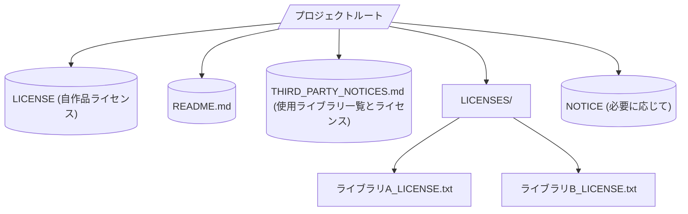
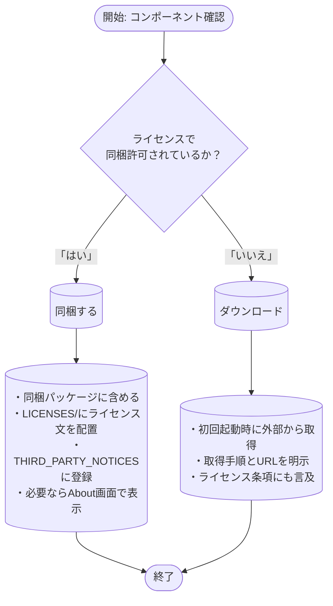

# 概要  
商用アプリに第三者コンポーネントを同梱する際は、そのライセンス条項を厳密に確認し、商用利用・再配布・改変の可否、表示義務、特許・輸出規制などのリスクを把握する必要があります。例えばPython本体はPSFライセンス（BSD系）で同梱が許可されていますが、ライセンス文書や商標表示が必要【11†L42-L44】【11†L49-L53】、一方GPLのライブラリをバイナリにリンクすると製品全体がGPL下で配布される義務が生じます【51†L225-L233】。機械学習モデルでは、Stable DiffusionのようにCreativeML Open RAIL-Mライセンスで配布され「配布時に必ずライセンス文を同梱し、派生作品にも同ライセンスを適用せよ」と定められています【18†L72-L78】。この報告書では、各コンポーネント種別ごとに確認すべき質問事項のチェックリストとその理由・条項例、Pythonランタイム・モデル・データ再配布時の一般的な落とし穴、推奨リポジトリ構成やドキュメント、同梱 vs ダウンロードの比較、さらに個人開発者向けガイド（同梱判断フロー、ライセンス代替案、許諾取得手順、リリース前チェックリストなど）を解説します。

## 同梱コンポーネント別 ライセンス確認項目  
同梱する各コンポーネントについて、以下のような問いを検討します。**理由**と**例示的なライセンス条項**を併記します。

- **ソースコード（オープンソース）:**  
  - **商用利用は許可されているか？**  
    商用製品への組み込み・販売がライセンスで認められている必要があります。例えばMITライセンスには「ソフトウェアを制限なく利用・複製・修正・再頒布できる」旨が明記されています【47†L27-L33】。これに対し、CC-BY-NCなどは非商用利用限定であり商用製品では同梱不可です。  
    例：「MITライセンス」“Permission is hereby granted, free of charge, to any person obtaining a copy … to *deal in the Software without restriction*【47†L27-L33】”。  
  - **改変・派生物の作成や再配布は許可か？**  
    コードを修正・派生して配布できるか確認します。GPLでは「GPLの下で配布せよ」と強く要求されますが、MIT/BSD系は「自由に派生・再配布可能、但し元の著作権表示と許諾文を残すこと」を条件とします【47†L33-L37】【49†L42-L49】。Apache 2.0も同様に二次配布を認めます【59†L161-L169】。  
    例：「3-Clause BSDライセンス」“Redistributions in binary form must reproduce the above copyright notice, this list of conditions and the following disclaimer…”【49†L45-L49】。  
  - **ソース公開・同梱義務はあるか？**  
    GPL系はバイナリ配布時に必ずソースも提供する義務が生じます。LGPLなら動的リンクに限定しないといけません。CC-BY-SA（データや辞書の場合）も派生物を同一ライセンスで公開することを要求します。  
  - **ライセンス表示や帰属表示が必要か？**  
    多くのライセンスは著作権表示とライセンス文の同梱を義務付けています。MIT/BSDでは「上記の著作権表示と許諾表示をすべての複製物に含めること」【47†L33-L37】【49†L42-L49】、Apache 2.0もライセンス文とNOTICE（あれば）を同梱することを要求します【59†L161-L169】【59†L169-L177】。CCライセンスではクリエイター表示が必須です。  
  - **特許に関する条項はあるか？**  
    Apache 2.0では「貢献者は特許権を恒久的に許諾する」【59†L143-L151】（特許訴訟には権利消滅条項付き）など明文化しています。一方MITやBSDには特許許諾条項が含まれていません。特許リスクに敏感な場合はApache採用のメリットがあります。  
  - **輸出管理規制は関わるか？**  
    暗号化技術を含む場合、輸出管理に注意が必要です。例えばPython本体は「マス・マーケット暗号ソフトウェア（ECCN 5D002）」とみなされますが、「パブリック・ドメインに相当し輸出可能」とされています【11†L78-L87】。ただし輸出規制を遵守する責任は開発者側にあります【11†L88-L95】。サーバーコンポーネントやモデルで暗号処理があれば同様に確認します。  
  - **商標使用上の制限はあるか？**  
    PythonではPSF商標の使用条件があります【11†L55-L58】。他ライブラリにも製品名の商標がある場合、ドキュメントや名称に注意が必要です。Apache 2.0も「商標使用権は付与されない」と明記します【59†L196-L199】。  
  - **依存関係やライセンス互換性に問題はないか？**  
    組み合わせる他コンポーネントとライセンスが矛盾しないか確認します。例えばGPLv2とApache 2.0は特許条項の相違で不整合になる場合があります。**GPLコードをバイナリにリンクすると製品全体がGPL配布要件を受ける**ことは厳守事項です【51†L225-L233】。  

- **コンパイル済バイナリ:**  
  ソースコードの項目に加え、配布形式がバイナリ（DLL/EXE等）になった場合の影響を検討します。例えば、Windows用DLLでは**特定のランタイム（VCランタイムなど）のライセンス**も考慮します。バイナリでも同様に「著作権表示を添付する」「ライセンスを同梱する」義務があるかを確認します【49†L45-L49】【59†L161-L169】。GPLライブラリをバイナリに含める場合は特に注意が必要です【51†L225-L233】。

- **Pythonランタイム:**  
  Python本体はPSFライセンス（BSD系）で、商用・同梱とも許可されています【11†L42-L44】。同梱時は**PSFライセンス文と旧ライセンス（CNRIライセンス）を含む「ライセンススタック」**すべてを同梱・表示する必要があります【11†L49-L53】。またPythonロゴや「Python」の名称はPSF商標なので、製品名への使用には**商標ガイドライン**の遵守が求められます【11†L55-L58】。Pythonの標準ライブラリは多くがPSFライセンスやBSD系ですが、第三者ライブラリは個別ライセンスなのでGPLなどが混入していないか確認してください【11†L65-L69】。  

- **MLモデル・重み:**  
  モデルや重みは通常独自ライセンスが付与されています。たとえばStable Diffusionは「Creative ML Open RAIL-M」ライセンスで公開されており、**配布時に必ずライセンス文を同梱し、派生モデルも同ライセンスで公開する**と規定されています【18†L72-L78】。商用利用は許可されますが、モデルが**有害生成への使用禁止**など追加制限を含む場合があります。また、訓練データに起因する著作権・プライバシー問題も検討事項です。モデル重みに関しても**パテントリスク**（モデルのアーキテクチャが特許で保護されている可能性）や輸出規制（特に暗号化モデル）を意識します。  

- **データセット・タグ辞書:**  
  データセットや辞書は創造物としてCCライセンス等で配布されることが多いです。例えばCC-BYでは**帰属表示必須**、CC-BY-NCは**非商用限定**です。商用製品にはNC条件付きのデータセットは同梱・利用できません。また、人名・顔画像データにはプライバシー規制（GDPR等）も関わります。必ず**出典とライセンス**を確認し、必要な帰属表示を行います。たとえばCC-BYでは「作者名・作品名・ライセンスを明示」するのが推奨です【60†L1-L4】。  

- **サーバーコンポーネント（例: JoyTagサーバ）:**  
  サーバー実装もソースコード同様、ライセンスで権利・義務を確認します。サーバーソフトがGPL等であれば、自社製品サーバとの組み合わせに注意が必要です。商用ライセンス製品の場合、既存の有償ライセンス契約の有無も調査します。なお、サーバー部分を自社でホストする場合は、純粋に自社運用で外部配布しない限りライセンス義務が異なる場合があります（例：AGPLはネットワーク越しでもソース提供義務）。  

以上の各質問を、対象コンポーネントのライセンス文中から確認します。ライセンス条項の該当箇所（例：許諾範囲、禁止事項、帰属表示義務）を実際にコピーして照合すると効果的です。  

## 再配布時の一般的な落とし穴  
PythonランタイムやMLモデル・データを再配布する際に注意すべきリスク例を挙げます。  

- **特許リスク:** オープンソースライセンス間で特許の扱いが異なります。Apache 2.0には明示的な特許許諾条項があり【59†L143-L151】、特許訴訟を起こすと特許権が消滅します。一方MIT/BSDは特許について明言がなく、潜在的に特許リスクが残ります。また独自モデルやアルゴリズムに関する特許が存在する場合もあるため確認が必要です。例えば有名な例としてJavaのAPIに関連するOracle vs Google訴訟があり、API自体の著作権・特許問題で争われました（ライセンス逸脱の事例）。  

- **輸出管理:** 暗号化や高度AI技術は輸出規制の対象となることがあります。Python FAQでも「Pythonはマスマーケット暗号ソフト（ECCN 5D002）だが、一般公開物扱いなので自由に輸出可能。ただし輸出規制順守はユーザー責任」【11†L78-L87】と説明されています。類似に、MLモデル（特に軍事用途関連のもの）にも制限がかかることがあります。製品を海外展開する場合は、自国・相手国の輸出管理法も確認しましょう。  

- **ライセンス互換性の問題:** 複数のライセンスを組み合わせた際、相反する条項で違反状態になる可能性があります。特にGPL系は閉源コードとの併用を厳しく制限します。たとえば**GPLライブラリをアプリにリンクする**と、アプリ全体をGPLで配布しなければならなくなります【51†L225-L233】。LGPLでも「置き換え可能であること」が必要です。逆にApache 2.0はGPLv2と互換しません（パテント条項の相違）、GPLv3とは互換します。これら互換性問題は、コンポーネント追加・更新時に発覚しがちです。  

- **著作権表示・帰属表示漏れ:** ライセンス違反の典型例は「ライセンス文や著作権表示を同梱しなかった」ことです【40†L151-L159】。例えばApache/MIT系では配布物に必ず著作権表示とライセンス文を含める必要があります【40†L151-L159】。漏れがあるとライセンス条件違反となり、法的リスクを招きます。  

- **SCA（ソフトウェア構成分析）・メタデータ不足:** ライセンス管理を容易にするために、SPDXなどで**コンポーネント情報を記録**しておくと安全です。SCAツールはSBOM（Software Bill of Materials）を自動生成し、依存関係とライセンスを可視化します【40†L221-L230】。メタデータ（名前・バージョン・ライセンス識別子等）が不足すると、監査時にライセンス不明扱いになることがあります。可能なら各ファイルに `SPDX-License-Identifier` を明記し、第三者通知ファイルにライセンス情報を網羅しておくべきです。  

- **プロビナンス（出所）管理不備:** 再配布するファイルの**出所とバージョン管理**があいまいだと、ライセンス違反時の言い逃れができなくなります。例えば同名のライブラリにバージョン違いのライセンスがあるケースや、派生元が不明なサードパーティーコードが混入した際、コンプライアンスチェックで問題になります。必ず公式配布物（公開リポジトリ、タグなど）から取得し、ハッシュや公開URLを記録して証跡としてください。  

- **機械学習モデル特有の留意点:** Stable Diffusionのようなモデルは、「オープンだが配布時に責任使用同意書を同梱せよ」といった新形態のライセンス（RAIL）を用います。例えばStable Diffusionの公開ライセンス条文には「配布する場合は必ず同モデルのLicenseを含め、変更版にも元ライセンスを適用せよ」と明記されています【18†L72-L78】【21†L337-L345】。このようなモデルを同梱する場合、ライセンスの**使用禁止条項**（人種差別表現禁止など）にも注意しなければなりません。また、モデル開発に使ったデータセット自体のライセンスや出自問題も潜在リスクです（例：LAIONデータセットの著作権対応など）。  

以上のような事例・落とし穴を踏まえ、公式ライセンス文やFSF/OSIの解説、ホワイトペーパー等で確認・対策を行ってください。  

## 推奨リポジトリ構成とドキュメント化  
第三者ライブラリや資産のライセンス遵守を明示・管理するには、明確なフォルダ構成と通知ファイルが有効です。以下は一例です。

- **`LICENSE`（ルート）:** 自社製品のライセンスを明示。  
- **`README.md`:** 製品概要とOSS使用の注意喚起を記載（使用OSSライブラリのライセンス概要や問い合わせ先を示す）。  
- **`LICENSES/`フォルダ:** 各同梱コンポーネントの「ライセンス原文」ファイルを置きます（例：`Apache-2.0.txt`、`MIT.txt`、商用ライセンス契約文書など）。**各ライブラリ名・バージョンも付記**しておくと管理しやすいです【45†L193-L202】。  
- **`THIRD_PARTY_NOTICES.md`（または`.txt`）:** 同梱したOSS/外部コンポーネントの一覧とライセンス情報、帰属情報をまとめたファイルです。各行・各項目にコンポーネント名、バージョン、著作者、ライセンス名、ソースURLなどを記載し、必要に応じて短い帰属テキストを添えます【45†L193-L201】。このファイルはプロダクトマニュアルや「About」画面などで参照できるようにするのが望ましいです【29†L236-L242】【45†L215-L223】。  
- **`NOTICE`ファイル:** Apacheライセンスの「NOTICE」条項を満たすために、必要な場合はNOTICEファイルを含めます【59†L169-L177】。独自の帰属要求があるライブラリに対して付加的な帰属情報を記載できます。  
- **ソースコードとLICENSE情報の紐付け:** 可能なら各ソースファイル冒頭に `SPDX-License-Identifier` コメントを付与し、ライセンス名を明示しておくと、スキャンツールによる検出が容易になります。  

また、各コンポーネントの**メタデータ**（第三者通知ファイルやSBOMに記載）として、以下項目を含めると良いでしょう：コンポーネント名・バージョン・著作者・ライセンス種別・ソースURL（ダウンロード元）・SHA256ハッシュ・再配布許可可否。例えば次表のように整理します。

| コンポーネント       | バージョン | ライセンス           | ソースURL                         | SHA256（例）                 | 同梱許可 |
|--------------|------|----------------|-------------------------------|------------------------|-------|
| JoyTagサーバ  | 1.2.3| Apache-2.0      | https://github.com/JoyTag    | 3f79bb7b435...        | 可（Apache-2.0条項遵守） |
| Python本体    | 3.11.4| PSFライセンス(BSD系)| https://www.python.org       | a4bfe0d345...        | 可（PSF条件で） |
| Stable Diffusion重み | v1.4  | CreativeML OpenRAIL-M | https://huggingface.co/…     | 9d6f1c8e47...        | 可（ライセンス同梱） |
| タグ辞書X     | 2020   | CC-BY-4.0       | https://example.com/dict.txt | e123abc456...        | 可（帰属表示要） |
| 商用SDKモデル | 2.1.0 | 独自商用ライセンス    | 販売元サイト                    | 7a8b9c0d12...        | ライセンス購入必要       |

さらに、**同梱とダウンロード**の方法を比較検討します：

| 方法                   | メリット                                            | デメリット                                             | リスク・留意点                                  |
|----------------------|-------------------------------------------------|----------------------------------------------------|-----------------------------------------------|
| **パッケージに同梱**      | - オフライン利用可能 - ユーザー手間なし - バージョン固定で動作保証 | - ライセンス遵守義務が直接自社に課される - 配布物が大きくなることも - 不要配布でNGになるライセンスは同梱不可 | 同梱するすべてのコンポーネントに対しライセンス文書・表示を適切に行う必要【47†L33-L37】【59†L161-L169】。配布禁止条件のある素材は同梱しない。 |
| **初回起動時ダウンロード** | - インストールパッケージを軽量化 - 一部ライセンスで配布扱いにならない可能性 - 最新版を取得しやすい | - ネット接続必須 - ダウンロード失敗時のUX問題 - サーバ維持コスト | ダウンロード方法や配信元URLを確実に明示し、ユーザーが許可された範囲内で取得すること【45†L245-L254】【51†L225-L233】。ライセンスが個別同意を求める場合は利用時の同意を案内。 |

## 商用インディープロダクト向けガイダンス  
以下、実践的な方針・手順を示します。

- **同梱 vs ダウンロードの判断フロー:**  
  まずライセンス条項を確認し、同梱が技術的・法的に許可されているかを判定します。許可があれば**同梱**し、含めるライセンス文書と帰属情報を整備します。許可されない場合は、代替手段として**初回起動時ダウンロード**を選択します（図参照）。同梱する際も、配布対象がバイナリならユーザーへの表示方法（例：`--notices`オプションやAboutページでの表示）を用意し、第三者通知をユーザーに提示できるようにします【29†L236-L242】【45†L239-L247】。

- **ライセンス互換性・代替の検討:**  
  同梱できないライブラリがあれば、**ライセンス互換な代替**を探す価値があります。たとえばGPLライブラリではなくLGPLやMITライセンスの同等機能ライブラリを使用する、CC-BY-NC辞書の代わりにCC-BY辞書を利用する、などです。独自商用ソフトの場合は商用ライセンスを購入できるか交渉も検討します。必要があれば、当該ライブラリの著作権者に直接「使用許諾契約」や「コマーシャルライセンス」の締結を申し込みます。【59†L196-L199】【51†L225-L233】  

- **リリース前チェックリスト:**  
  1. **法律レビューと社内承認:** 最低でも法律担当またはOSSコンプライアンス担当者が使用コンポーネントとライセンスを確認し、問題点をクリアにします。  
  2. **自動ライセンススキャン:** CIパイプラインにSCAツール（FOSSA、Black Duck、OSS Review Toolkitなど）を組み込み、依存関係とライセンスを自動検出します【40†L283-L288】。疑義ライセンスはCIエラーにし、開発者にフィードバックを返すとよいでしょう。  
  3. **SBOM/SPDXの作成:** 依存関係リストをSBOMとして出力し、コンポーネント名、バージョン、ライセンスを文書化します【40†L221-L230】。ビルド成果物にSPDXドキュメントを添付する運用も考慮します。  
  4. **ドキュメントの整備:** READMEや製品マニュアルに「本製品には下記OSSを含む、ライセンスは添付のNOTICE/THIRD_PARTY_NOTICESに記載」と明記します。第三者ライセンスファイル（LICENSES/）と同義文書（NOTICE）を必ずビルド物に同梱します【38†L676-L683】【45†L193-L202】。  
  5. **最終リリース承認:** コンプライアンス担当から最終サインオフを受けます。OSS法務の専門家（弁護士等）によるレビューがある場合は合わせて実施します。  

- **CI/自動化チェック:**  
  ビルド時にSPDX/ライセンスIDがソースに埋め込まれているかや、THIRD_PARTY_NOTICESへの未記載コンポーネントがないかなどをCIで検証できます。また、セキュリティ脆弱性スキャンと同様に定期的な監査を自動化しておくと安心です【40†L283-L288】。

以上を組み込んだワークフローを維持すれば、インディー開発者でもOSSライセンスリスクを低減しつつ商用製品を展開できます。  

# 参考資料  
- Python公式FAQ – Pythonライセンスと商標【11†L42-L44】【11†L55-L58】【11†L78-L87】  
- Stable Diffusion Public Release（Stability AI）– CreativeML OpenRAIL-Mライセンス【15†L215-L223】  
- AWS「What is Stable Diffusion?」– 使用ライセンスと配布条件【18†L72-L78】  
- Bart van Ingen Schenau「Embedding GPL code…」– GPLのリンク義務【51†L225-L233】  
- OSSコンプライアンス記事（CTOx）– ライセンス違反例およびSCA【40†L151-L159】【40†L283-L288】  
- Software Eng. StackExchange「ライセンス・ペーパーワークの実例」– 同梱サンプル【45†L193-L202】【45†L215-L223】  
- Google Open Source – ライセンス表示ガイド【29†L236-L242】  
- Apache License 2.0（公式）– パテント・配布・商標規定【59†L143-L151】【59†L161-L169】【59†L196-L199】  
- MIT License（ChooseALicense）– 許諾条項例【47†L27-L35】  
- BSD 3-Clause License – 条件例【49†L42-L49】  

