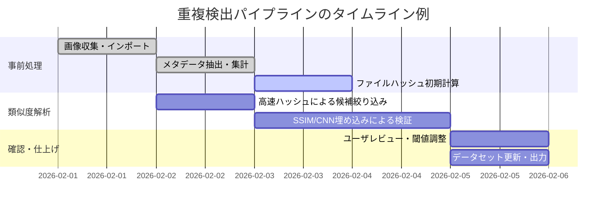

# 画像重複検出の概要

複数の画像検索や学習データセット作成において、同一または類似画像（重複・準重複）の検出は重要である。本報告では、**デスクトップ環境で実装可能な高速な手法**に焦点を当てて、各手法のアルゴリズム、実装例、前処理、パラメータ、計算コストと精度のトレードオフ、閾値設定、可視化、および実践的なワークフローを総合的に解説する。

## 1. アプローチ一覧

1. **知覚ハッシュ (Perceptual Hash)**: 画像の内容を反映する簡易な固定長のハッシュ値を計算し、Hamming距離などで類似度を評価する手法群。代表的なものに **平均ハッシュ (aHash)**、**差分ハッシュ (dHash)**、**DCTベースのハッシュ (pHash)** がある。実装例としてPythonの [imagehash](https://github.com/JohannesBuchner/imagehash) やOpenCVの`cv2.img_hash`モジュールがある。  
   - **平均ハッシュ (aHash)**: 入力画像をグレースケールで8×8に縮小し、全画素の平均輝度より明るい画素を1、暗い画素を0として64ビットのバイナリ列を得る【15†L14-L18】【48†L113-L114】。非常に高速だが、簡素な手法のため画像の複雑な変化には弱い（明るさ変化や小さなノイズには耐えうる）。実装には`imagehash.average_hash`やOpenCVの`AverageHash`クラスが使える【48†L113-L114】。ハッシュ長（通常64ビット）は`hashSize=8`などで設定可能。  
   - **差分ハッシュ (dHash)**: グレースケール画像を(ハッシュ長+1)×ハッシュ長（例:9×8）に縮小し、水平方向の隣接画素間の輝度差を比較してビット列を生成する【19†L509-L518】。輝度勾配に基づくため、aHashよりも輝度変化に少し強い。実装例としてOpenCV/Pythonコードや`imagehash.dhash`がある【19†L509-L518】。パラメータ`hashSize`(デフォルト8)で精度を調節。ハミング距離の閾値は経験的に「10ビット以下なら同一画像の可能性あり」（それ以上は異なる可能性高い）などが指摘されている【41†L461-L465】。  
   - **知覚ハッシュ (pHash, DCTハッシュ)**: 画像をグレースケールで32×32に縮小し、離散コサイン変換(DCT)を適用して得られる係数の上位8×8領域（低周波成分）を取り出し、その中央値でビット化する手法【32†L89-L97】。中央値で二値化することで1と0が半々に近くなり、均等化される【32†L89-L97】。OpenCVの`PHash`クラスや`imagehash.phash`で実装可能で、pHashライブラリ（C++）も存在する。速度はaHashより遅いが、JPEG圧縮や輝度変化などの小さな変形に対してよりロバストである【46†L104-L109】【43†L280-L287】。標準的にはガウスぼかしやガンマ補正を前処理として行い、生成する128ビットや64ビットハッシュを比較する。  

2. **画像リサイズ＋ハッシュ**: 画像を固定解像度（例: 256×256）にリサイズし、通常の暗号ハッシュ（MD5/SHA-1）を計算する手法。これは**ビット単位で完全一致を検出**するのに有効で、リサイズのみで内容を同じにすればハッシュ一致する。ただし小さなトリミングや回転などで内容が変わると全く一致しないため、厳密な重複検出向けである。オープンソースにはファイルサイズやファイルハッシュを使った重複検出例が多い。  

3. **構造類似度（SSIM）**: **Structural Similarity Index (SSIM)**は、画像の輝度・コントラスト・構造の局所的統計量を比較し、類似度（通常0～1）を算出する指標【54†L562-L564】。SSIM=1は完全一致、0に近いほど非類似を示す。アルゴリズムはWangらによるもので、典型的には$11×11$画素のスライディングウィンドウでピクセル間の共分散や平均を計算して指数化する【54†L562-L564】。Pythonでは`scikit-image`の`structural_similarity`関数で利用可能で、デフォルトパラメータはガウス重み有効（$\sigma=1.5$）かつ中央値使用など原論文に近い設定とされる【54†L652-L660】。サイズの異なる画像は事前に同一解像度に揃える必要がある。SSIMは画像全体の平均（MSSIM）で扱われることが多い。速度はピクセル数に依存し、1000×1000画像で数十ms程度かかるため、候補絞り込み後の詳細比較に適する。  

4. **特徴量埋め込み (CNN・CLIP)**: 事前学習済みの畳み込みニューラルネットワークやVision Transformer（CLIP等）を使い、画像を固定長のベクトルに変換して類似度を比較する手法。具体例として、OpenAIの**CLIP**【58†L136-L144】（ViTベースまたはResNetベースのモデル）で画像を512次元ベクトルにエンコードし、コサイン類似度で比較する方法がある。他に、TensorFlow/PyTorchの**MobileNet**や**EfficientNet**など（ImageNetで事前学習済み）から最終全結合層前の特徴量(例:1024次元ベクトル)を抽出する方法がある。こうした埋め込みは、色変換やオブジェクトの部分的な変化にも比較的ロバストであり、**深い意味での類似**（セマンティックな類似度）も捉えられる場合がある。一方で推論コストが高く、GPUがないと数百ms/画像かかることもある。実装にはOpenAI-CLIPライブラリ、TensorFlowの`tf.keras.applications.MobileNet`/EfficientNetモデル、PyTorchの`torchvision.models`などが利用できる。比較には正規化済み埋め込み間のコサイン距離やL2距離を用いる。  

5. **キーポイントマッチング (ORB/SIFT)**: 画像中の特徴点（エッジやコーナー）を抽出し、局所記述子をマッチングする手法。**SIFT**や**ORB**が代表例で、前者はスケール・回転不変性に優れるが重く、後者はバイナリ記述子で高速かつ無料実装可能（OpenCVで`cv2.ORB_create()`）である。アルゴリズムは、FASTやDoGなどで特徴点を検出し、BRIEF（ORB）やSIFT記述子で特徴量を表し、BFMatcherやFLANNで2画像間のマッチングを行う。良好なマッチ数やマッチの距離比（Loweの比率テスト）で画像類似度を判定する。ORBは数ms以内で数百点を抽出できるのに対し、SIFTはより遅い（例: GPUなしで0.1秒/画像以上）【76†L1798-L1806】。明るさ変化には強いが、SSIMや埋め込みに比べると画像全体の差異には敏感である。パラメータとして抽出特徴点数（例500点）や距離比テストの閾値（0.7～0.8）を調整する。  

6. **メタデータ・ファイル属性**: 画像ファイルに含まれるEXIF情報（撮影日時、カメラモデル、GPS座標など）やファイル名、ファイルサイズといった属性を用いる手法。例えば撮影日時やデバイス名が全く同じ画像は重複の疑いが強いし、ファイルサイズが完全に一致する場合はファイル内容が同一である可能性が高い。これらは画像内容そのものではないため、あくまで**候補絞り込み**に有用であり、単独で完全な類似度判定はできない。しかし「まったく同一画像」（ビット単位で同一）の検出では、ファイルのMD5/SHA-1ハッシュ計算が最速・確実である（高速だが、微小な違いで全く異なるハッシュになる）。実装例としてはPythonの`PIL.Image._getexif()`でEXIF取得や、`os.path.getsize()`によるファイルサイズ取得、`hashlib`によるハッシュ計算などがある。  

## 2. 計算コストと精度のトレードオフ

各手法の計算コストはアルゴリズムの複雑度や前処理、パラメータに依存し、精度面では「完全一致（重複）」と「準一致（ほぼ同一）」で特性が異なる。主要な比較ポイントを以下にまとめる。  

- **ハッシュ系 (aHash/dHash/pHash)**: 画像を固定小サイズに縮小し固定回数の演算（加算・比較・DCTなど）を行うため、処理時間は画像解像度に比例しない定量のオーダーとなる。例えばaHash/dHashでは数千×1000画素クラスの画像で1枚あたり約1ms以下で計算可能（CPU単体でも十分高速）である。Zaunerらのベンチマークでは、平均ハッシュ（ブロック平均法）が最速で、DCTベース(pHash)が最も遅いと報告されている【43†L280-L287】。メモリ使用もごく少量で、各画像のグレースケール縮小版を保持する程度で済む。精度面では**精度（Precision）**は高く、完全一致画像は100%検出可能である（pHashは微小な違いを吸収するが、aHash/dHashはより厳密）。**再現率（Recall）**は“ほぼ同一”画像に対して異なる。一般に、ハミング距離閾値を緩めるほど再現率は上がるが誤検出も増える。実務では「ハミング距離 ≤5 ～ 10なら同一とみなす」例が多い【41†L461-L465】。ROC曲線では、閾値調整可能だが、例えばpHashは完全一致では安定して小さい距離を示し、微小変形で徐々に距離が増える特性を持つ。  
- **SSIM系**: 画像の全画素を滑らせて局所的に比較するため、計算量は画像画素数に線形(O(N))で依存する。1000×1000画素程度で数十ms程度（CPUマルチスレッド、scikit-image等で数ms〜10ms前後）かかる例があるため、ハッシュに比べると遅い。一方、構造的な差異に敏感かつ人間視覚に沿った評価が可能なため、精度（特に再現率）が高い傾向にある。完全一致画像ではSSIM=1となる【40†L596-L600】。閾値設定例としては0.95以上でほぼ同一とみなすケースがある【40†L596-L600】。計算では画像を同一サイズに揃え、ガウス加重平均（σ=1.5、ウィンドウ11程度）を用いると原論文に準拠した高精度な結果が得られる【54†L652-L660】。  
- **CNN埋め込み (MobileNet/EfficientNet)**: CNNモデルの前向き推論には多くの演算（畳み込みなど）が必要で、CPU実行では数百ms～秒単位、GPU搭載なら10枚程度/秒以上になる。Edge向けMobileNet/軽量EfficientNetならCPUで50～100ms/画像（224×224入力）程度の事例がある（GPUでは1桁ms）。特徴量次元は512～1280程度であり、ベクトル比較は高速（コサイン距離計算は数百次元の内積程度）。精度としては、色変換や明度変化、部分的な切り抜きにも比較的ロバストであり、セマンティックに異なるが画像が似ていれば高類似度を示すこともある。逆に、平凡な画素差（ノイズ）には影響されにくい。ROCでは、コサイン類似度0.9以上なら非常に類似度が高い例が多い。実験的に0.95や0.9を閾値とする提案もあるが、データ依存である。  
- **ORB/SIFT**: 特徴点抽出・マッチングは画像サイズに比例するが、点数Nを制限すれば実行は高速化できる（ORBなら数百点、SIFTはデフォルト300点程度）。ORBはバイナリ記述子のため高速で、一般にSIFTより数倍速い【76†L1798-L1806】。メモリ使用は特徴点×記述子次元（ORBなら32バイト/点）である。完全一致画像ではキーポイントマッチはほぼ全点マッチするため検出率は高いが、部分的なクロップや大きな回転変化では検出率が下がる。逆に、多少の回転・スケール差には耐える。精度面ではヒューリスティックに依存し、一般的には閾値なしで「マッチ点数が十分多い＝類似」と判断する。誤検出低めで精度は比較的高いが、画像ごとに閾値調整は困難。  
- **メタデータ/ファイル属性**: 計算コストは極小さい（ファイルハッシュ計算はI/O依存だが高速ライブラリで数ms/ファイル）。完全一致判定（MD5など）では偽陽性ゼロで完全検出できるが、**準一致**には一切対応できない。EXIF比較も閾値設計が難しく、**フィルタリング**目的に限定される。したがって高速・簡易だが精度（再現率）は限定的である。

## 3. 閾値設定と結果提示方法

各手法の結果をユーザに提示する際は、**類似度スコア**（ハミング距離、SSIM値、コサイン距離など）や**クラスタリング**結果として見せるのが一般的である。  
- **ハッシュ類**: ハミング距離閾値を設定する。例えばpHashでは「0ビット（完全一致）または1～5ビット以内なら同一視、10ビット以上なら別画像視」が経験的指針である【41†L461-L465】。ユーザには「距離0: ほぼ完全同一」「距離5: 色調違いや細部ノイズ程度」「距離10: 大きな変化あり」と説明できる。検索結果には「Hamming距離」を表示し、閾値以下なら重複候補としてグループ化する。  
- **SSIM**: SSIMは0～1の値で出力されるため、「SSIM > 0.95」をほぼ同一とみなす例がある【40†L596-L600】。閾値を緩和して0.9程度に設定すると多くの近似画像を拾えるが、誤検出が増える。UIでは「SSIM = 0.97 (非常に類似)」などとスコアで示し、ビジュアル差分やレイヤー強調で違いを提示することも有効である。  
- **CNN埋め込み**: 埋め込みはコサイン類似度で0～1を示し、しきい値例として0.9～0.95が多い。例えばPyTorchやTensorFlowで正規化した特徴ベクトルに対し「cosine similarity > 0.9なら類似」とする。類似度ヒストグラムを計算し、ROC曲線から最適閾値を決める手法もある。ユーザー向けには「類似度 = 0.92 (相関あり)」などスコア化し、代表画像と並べて見せる。  
- **キーポイント**: マッチ点数の閾値設定が主となる。単純には「マッチ点数 > X（例: 50点）」で候補抽出し、最終的には手動確認を推奨する。UI上では「対応点数：120/150」などを表示し、視覚的にマッチ状況（線で接続した図）を見せる例もある。  
- **グルーピング表示**: 重複検出の結果は、**クラスタリング**して各グループから代表画像を抽出し、グループ内の画像を並べて一覧提示する形式がよい。例えばサムネイルを時系列や距離の昇順で並べ、グループに信頼度（類似度スコアの平均など）を添える。視覚的には左から原画像、右へ類似画像を並べ、類似度をパーセントや色付きバーで示す手法が多い。  
- **差分表示**: 画像ペアの類似度判定には、画像差分やオーバーレイを示すとわかりやすい。たとえばSSIM差分画像や左右比較スライダー、ハイライトされた対応点などで差異を強調し、ユーザに直感的な判断材料を提供する。  

## 4. 実践上の推奨

- **重複の有害度**: 学習データにおいて完全重複や極度に類似した画像が大量に含まれると、**過学習**や**データリーク**につながり得る。【70†L177-L180】によれば、CIFAR-10/100のトレーニング/テストセット間に重複があると、除去後の精度が10%前後低下する事例も報告されている（データリーク効果）。同一クラスの同一画像が重複すると、その画像への依存度が高まり汎化性能が下がる。逆に少数の重複はデータ拡張と解釈される場合もあるが、安全のため**完全重複は除去**する方が無難である。  
- **ワークフロー**: 一般的には**ブロッキング**→**候補生成**→**確認検証**の段階を踏む。まずファイルサイズや解像度といった粗い属性で画像をグループ化し、比較対象数を減らす（ブロッキング）。次にブロック内でaHash/dHashなど高速な手法で類似候補を抽出し、さらにSSIMやCNN埋め込みなど精密な手法で上位候補を絞り込む。最後に人手目視または高精度検出で確認し、閾値を微調整して最終リストを作成する。  
- **オンライン処理**: データセットが増分更新される場合は、既存画像のハッシュや埋め込みをデータベースに保存し、新規画像を追加時にインクリメンタルに比較する方式が有効。局所感度ハッシュ(LSH)や近傍探索（ANN）ライブラリを用いて高速化できる。バッチ処理なら定期的に全件スキャンし、増加分のみ部分比較を行う。  
- **ツール連携**: データ準備パイプラインに組み込む際は、たとえば学習前に一括で重複検出スクリプトを実行してクリーンなデータセットを作成する。Pythonなら`hashlib`/OpenCV/CLIPモデルなどを組み合わせてDedupモジュールを自作可能。既存ツールでは、[FiftyOne](https://github.com/voxel51/fiftyone) などのデータセット管理ライブラリが重複検出機能を備えており、ハッシュや埋め込みによるグループ化が可能である。  

## 5. 手法比較表

以下に主な手法を**速度 (高速/低速)**、**精度 (低/中/高)**、**必要リソース (CPU/GPU)**、**変換耐性 (画素変化, 回転, 圧縮等)**、**実装容易度**で比較した。

| 手法                  | 速度              | 精度 (再現率) | リソース      | 変換耐性                | 実装容易度         |
|:-------------------|:------------------|:-------------:|:--------------|:-----------------------|:-----------------|
| **ファイルハッシュ**    | ★★★ (超高速)       | ★☆☆ (完全一致のみ) | 低 (CPU)      | なし (完全一致のみ)        | ★★★ (簡単)         |
| **平均/差分ハッシュ**   | ★★★ (高速)         | ★★☆☆ (色変化や圧縮弱) | 低 (CPU)      | 中 (輝度変化、JPEG圧縮)   | ★★★ (簡単)         |
| **DCT(pHash)**      | ★★☆☆ (中速)       | ★★★☆☆ (JPEG,小変化OK) | 低 (CPU)      | 高 (輝度,圧縮,軽度トリム)  | ★★☆ (実装容易)     |
| **SSIM**            | ★☆☆ (遅い)        | ★★★ (高い)       | 低 (CPU)      | ★★☆ (コントラスト等)     | ★★☆ (要実装)       |
| **CNN埋め込み**       | ★ (遅い/要GPU)      | ★★★ (高)        | 中 (GPU推奨)   | ★★★ (セマンティック)      | ★ (要学習環境)      |
| **ORB/SIFT**        | ★★☆ (中速)       | ★★☆ (高)       | 低 (CPU)      | ★★★ (回転,スケール変化)  | ★★☆ (OpenCV)      |
| **EXIF/ファイル属性** | ★★★ (超高速)       | ★☆☆ (補助的)     | 低 (CPU)      | 対象外                  | ★★★ (簡単)         |

★3つ＝優良、★2つ＝中程度、★1つ＝限定的。

## 6. ワークフローとプロセス図

以下は重複検出パイプラインの例を示す。まずメタデータやファイルハッシュで粗いブロッキングを行い、その後にハッシュや埋め込みを使って類似群を生成、最後に詳細な類似度指標で検証する流れである。

```mermaid
flowchart LR
    A[画像収集] --> B[メタデータ・ファイル属性処理]
    B --> C[高速ハッシュ計算 (aHash/dHash/pHash)]
    C --> D[クラスタリング (類似グループ作成)]
    D --> E[詳細類似度計算 (SSIMやCNN埋め込み)]
    E --> F[重複候補のグループ提示]
    F --> G[ユーザ確認・除去]
```

さらに、重複検出作業のタイムライン例をガントチャート風に示すと以下のようになる。データ収集からクリーニング完了までの日数の流れで、各ステップの優先度や並行処理を表した。



## 参考文献

- Alex Bessell 等, *OpenCV ImageHashモジュール*【46†L104-L109】【48†L113-L114】  
- W. Wang, A.C. Bovik, *Image Quality Assessment: From Error Visibility to Structural Similarity*, IEEE TIP (2004)【54†L662-L670】  
- S. Zauner, *Implementation and Benchmarking of Perceptual Image Hash Functions* (論文)【43†L280-L287】  
- M. Krawetz (Neal Krawetz), *HackerFactor Blog*, 2006 (aHash/dHash/pHashの解説)【15†L14-L18】【41†L461-L465】  
- S. Chaudhury ほか, *EnsembleSkinNet: explainable AI in skin cancer detection*, **Plos One** (2024)【40†L596-L600】  
- İ. Barz, J. Denzler, *A Closer Look at Memorization in Deep Networks*, arXiv:2101.09291 (引用されたCIFAR重複除去結果)【70†L177-L185】  
- OpenAI, *CLIP: Connecting Text and Images*, 2021【58†L136-L144】 (モデル概要)  

（上記のリンクは参照のための出典であり、各手法に関する詳細記述や実装例を示している。）