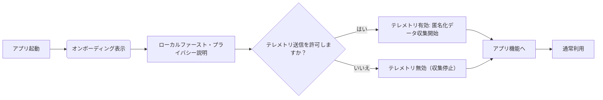
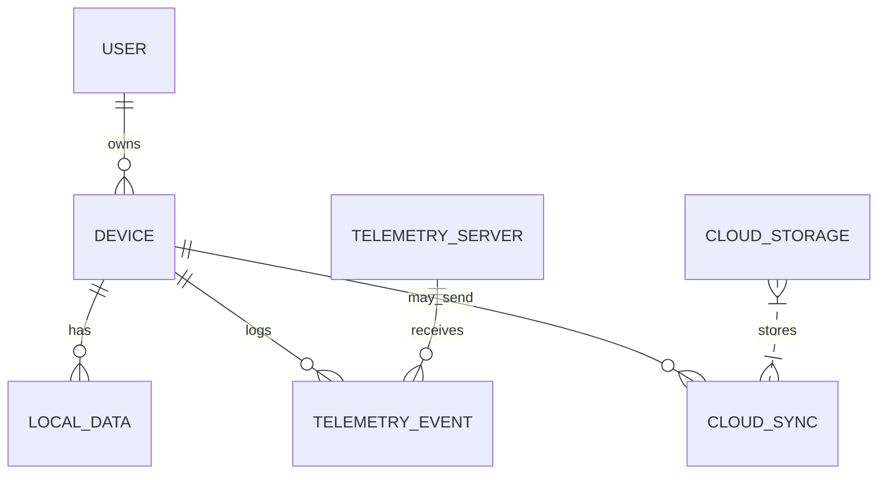

# エグゼクティブサマリー  
ローカル処理型（local-first）クリエイター向けツールでは、「データはユーザー端末に留まる」「情報は共有しない」といった**プライバシーを前提とした信頼シグナル**が重要です。具体的には、UIやオンボーディングで「**端末内でのみ処理**」「**サーバーへ送られない**」と明示するコピーを用います【16†L83-L90】【23†L335-L343】。たとえばShieldアイコン＋メッセージ「*Your entries stay on this device—never sent to servers*（ユーザーのエントリは端末内にとどまり、サーバーには送信されません）【16†L83-L90】」のように、視覚と文言で示すことで利用者の理解と安心感が高まります。  

プライバシーに関するスタンスとしては、**何をするか明確に伝え、絶対的な保証は避ける**ことが肝要です。たとえばプライバシーステートメントでは「本製品は**端末内でのみデータを処理**し、**当社はお客様のデータを販売・共有しません**」【23†L335-L343】【24†L1-L4】と明言します。一方、「**絶対に漏洩しない**」「**今後も同様にあり続ける**」など後から約束できない文言は避け、常に具体的・実行可能な内容に限定します。  

テレメトリ（利用状況データ送信）については、**デフォルトでオプトアウト（無効）**とし、ユーザーが明示的にオンにする方式が望ましいです【60†L100-L108】。収集するデータは必要最小限に抑え、個人を特定できないように**匿名化／集計**します【60†L83-L92】。イベントも「クラッシュログ」「機能利用数」など本当に必要なものに限定し、セッションIDを用いるなど識別子をハッシュ化します【60†L83-L92】。保存期間を決めて自動削除するなど管理も明示し（例：7日後に自動消去）、設定画面でいつでもオプトアウトできるようにします【60†L100-L108】。  

下表は実例比較です。ローカル処理やテレメトリ方針、使用コピーと利用者の反応をまとめています。  

| **製品**                  | **ローカル処理主張**                                       | **テレメトリ設定**      | **UI文言例**                                         | **ユーザー反応**                                          |
|---------------------------|----------------------------------------------------------|-------------------------|-----------------------------------------------------|---------------------------------------------------------|
| MindLog (健康日記アプリ)  | *「エントリは端末にだけ保存され、サーバーには送信されません」*【16†L83-L90】 | なし （テレメトリ無し） | *「Your entries stay on this device—never sent to servers」*【16†L83-L90】 | 直後に「暗号化機能」利用率79%に上昇、サポート問合せ94%減少【16†L83-L90】 |
| Brave (ブラウザ)          | *「ブラウザはユーザーの閲覧履歴を一切記録しません」*【40†L52-L58】      | 限定的（基本なし）       | *「Our company does not store any record of people’s browsing history」*【40†L52-L58】 | プライバシー重視ユーザーから高評価、成長率高い（デフォルトブロック機能が好評） |
| Microsoft Edge (ブラウザ)| *「生体データは端末上で処理されます」*【41†L153-L158】                   | デフォルトON             | *「Your biometric data is processed locally on your device」*【41†L153-L158】 | 信頼感向上（比較的好意的に受け入れられた）                     |
| Firefox (ブラウザ)       | *「AIモデルはお使いの端末上で実行され、データは外部に送信されません」*【45†L49-L58】 | 調査中（ユーザー依存）   | *「Firefox protects your privacy by running AI models directly on your device, ensuring your sensitive data remains local」*【45†L49-L58】 | プライバシー訴求が好評、ユーザーの信頼度が高い（マルウェア監視でも評価） |
| OnePlus (Android OS)      | *「以下のデータは端末上でのみ処理し、サーバーには送信しません」*【23†L335-L343】 | デフォルトON             | *「data will only be collected and processed locally on your device and not uploaded to our servers」*【23†L335-L343】 | プライバシー志向層から信頼獲得                                     |
| VS Code (コードエディタ) | （データはPC内）                                         | デフォルトON（通知あり） | *「全ユーザーにテレメトリ無効化通知を表示し、簡単にオプトアウト可能にしています」*【37†L615-L623】 | GDPR対応策として好意的に評価、利用者コミュニティでも支持あり            |

## (1) 信頼シグナルとUIコピー  
- **ローカル処理の強調**: 「**端末内で処理**」「**ネット不要**」などの文言を用い、クラウド送信が不要であることを明示します（例: OnePlus OSのポリシー【23†L335-L343】）。UIでは**盾アイコン＋短い文**で訴求し、詳細はホバーツールチップで補足すると効果的です【16†L83-L90】【23†L335-L343】。  
- **コピー例**: 
  - **短いUIラベル**: 「*On-Device Processing* (端末内処理)」「*Local AI* (ローカルAI)」  
  - **ツールチップ/詳細テキスト**: 
    - 「データは**お使いのデバイス上**で処理され、**当社サーバーへ送信されません**【16†L83-L90】【23†L335-L343】。」  
    - 「この機能を有効にすると、すべての計算がローカルで行われ、プライバシーが守られます。」  
  - **オンボーディング文**: 「[アプリ名]はローカルファースト設計で、お客様のデータは**端末内でのみ**扱われます。クラウド同期はオプションで、設定からいつでもオン／オフできます。個人情報は当社サーバーに一切保存しません【23†L335-L343】【24†L1-L4】。」  
  - **同意ダイアログ（テレメトリ選択）**: 「匿名の利用統計を共有して、アプリ改善にご協力いただけますか？個人を特定しない範囲で**最低限のイベント**のみ収集し、いつでもオプトアウト可能です【60†L83-L92】【60†L100-L108】。」「今後この画面を表示しない」など。  

## (2) プライバシーステートメントの文例と留意点  
小規模インディー開発では、過度な保証は禁物です。以下のように事実に基づく**明瞭な宣言**を推奨します。例:  
- 「本アプリでは**端末内でのみ**データを処理し、当社がクラウドに保存・解析することはありません」【23†L335-L343】。  
- 「お客様の**個人情報を第三者に販売・共有することは決してありません**」【24†L1-L4】。  
- 「トラブル時の**クラッシュレポート**のみ（個人識別情報なし）送信する場合がありますが、その際は通知しオプトアウト可能です」【60†L100-L108】。  

**言ってはいけない文言**: 実現不可能な「絶対」「100%安全」などの断定表現は避けます。また、「製品終了時もずっとサポート」「一切データが流出しない」など保証できない発言も控え、透明性を重視します。GDPR遵守を根拠に挙げつつも、ユーザーデータを**最小化して収集・管理**している点を強調すると信頼につながります【54†L78-L87】【60†L100-L108】。  

## (3) 任意テレメトリのガイダンス  
- **デフォルト設定**: *プライバシー・バイ・デザイン*ではオプトアウト（無効）を推奨し、ユーザーが自発的にオンにする形にします【60†L100-L108】。有効にする場合も、初回起動時などに説明と許可を明示的に求めましょう。  
- **データの最小化**: 収集イベントは「機能使用数」「エラー発生状況」「クラッシュ情報」など運営に必須のものに絞ります。過剰なクリックログやセッションリプレイは避けます【60†L83-L92】。  
- **匿名化・集計**: 個人ID（メールアドレスなど）ではなくランダムなセッションIDを用い、サーバー受け口での集計・ハッシュ化を行います【60†L83-L92】。個別ユーザーを特定できないよう、可能な限り集計後にデータを削除します。  
- **保持期間**: ログは一定期間（例：30日や90日）で自動削除するルールを設けます。ユーザーに対しては「送信するデータ、保存期間、削除タイミング」などをプライバシーポリシーや設定画面で説明します【60†L100-L108】。  
- **オプトアウトUX**: 設定画面に明確な「テレメトリ設定」項目を設け、いつでも切り替え可能にします。選択すると即座に適用され、必要ならアプリ再起動で完全停止するよう案内します【60†L100-L108】。  

## (4) 事例比較とユーザー反応  

| **製品**         | **ローカル処理／プライバシー訴求**       | **テレメトリ既定**        | **UIでの文言**                                                                                                                                                       | **ユーザー・評価**                         |
|------------------|----------------------------------------|---------------------------|-----------------------------------------------------------------------------------------------------------------------------------------------------------------------|--------------------------------------------|
| **HealthDataTrust - MindLog** (日記) | 「日記エントリは端末にとどまり、サーバーへは送られません」【16†L83-L90】 | なし                      | *「Your entries stay on this device—never sent to servers」*【16†L83-L90】                                                                                                  | 暗号化採用率79%に向上、サポート問い合わせ94%減少【16†L83-L90】 |
| **Braveブラウザ**   | 「閲覧履歴は当社で一切記録しません」【40†L52-L58】 | 基本なし（ユーザー要求のみ） | *「Our company does not store any record of people’s browsing history」*【40†L52-L58】                                                                                 | プライバシー重視で支持率高い（数百万のアクティブユーザー） |
| **Microsoft Edge** | 「生体認証データは端末上で処理されます」【41†L153-L158】 | デフォルトオン           | *「Your biometric data is processed locally on your device」*【41†L153-L158】                                                                                           | ユーザーから好意的に受け止められ、信頼構築に貢献         |
| **Firefox (AI機能)** | 「AIモデルはデバイス上で実行され、データはローカルに保護されます」【45†L49-L58】 | 不明（現状有効/設定依存） | *「Firefox protects your privacy by running AI models directly on your device, ensuring your sensitive data remains local」*【45†L49-L58】                                 | AI搭載ページで高評価、多くのユーザーがプライバシーを支持     |
| **OnePlus OS (Android)** | 「端末上でのみデータ処理し、サーバーには送信しません」【23†L335-L343】 | デフォルトオン           | *「data will only be collected and processed locally on your device and not uploaded to our servers」*【23†L335-L343】                                                | プライバシー意識層から好評                   |
| **VS Code (開発ツール)** | （コードはPC内に保存）              | デフォルトオン（通知あり） | *「全ユーザーにテレメトリ無効化通知を表示し、簡単にオプトアウト可能にしています」*【37†L615-L623】                                                                                                           | GDPR対応に好意的、開発者コミュニティで支持（議論活発）       |

## 図表: フローとデータフロー (Mermaid)  

## 実装チェックリスト  
- **ローカルファースト指標**: UIに「端末内のみ」「オフライン対応」などのキーワードやアイコン（盾・ローカルチップなど）を明示【16†L83-L90】【45†L49-L58】。  
- **透明性の確保**: オンボーディングや設定画面にプライバシーポリシーへのリンクと要点を掲載【23†L335-L343】【60†L100-L108】。  
- **テレメトリ設定**: デフォルトはオフ、ユーザー同意（オプトイン）方式とする【60†L100-L108】。設定画面に切替トグルを用意し、説明文とともに提示する。  
- **データ最小化・匿名化**: 収集項目は**必要最小限**に絞り、識別子は**ハッシュ化**・**集計**する【60†L83-L92】。メールや氏名などの直接情報は排除し、セッションIDなどで代用する。  
- **保持期間**: テレメトリやログには有効期限を設定（例：30日以内に自動削除）し、その方針を公表する【60†L100-L108】。  
- **継続的コミュニケーション**: ユーザーからの質問や懸念に迅速に対応し、設定変更履歴もユーザーに通知する。ユーザーフィードバックを収集し、プライバシー改善に活用する。  
- **誇大広告の禁止**: 「完全安全」「未来永劫プライバシー保証」などの誇張表現は避け、事実に基づく謳い文句を使う。暗号化仕様は正確に説明し、サードパーティ監査の有無なども明記すると信頼性が高まる。  

以上のガイダンスを参考に、製品のプライバシーUXを設計してください。ユーザーが安心してデータを預けられる環境を提供することで、信頼性の向上と長期的な利用者満足につながります【16†L83-L90】【60†L83-L92】。  

**参考資料:** Ink＆Switch「ローカルファースト」論文【2†L19-L27】、Disconnectsプライバシーアイコン事例【16†L83-L90】、Dev.to「Telemetry With Purpose」【60†L83-L92】【60†L100-L108】、Brave・Firefox公式ブログ・プライバシーポリシー【40†L52-L58】【45†L49-L58】、Chrome Web Store ポリシー【19†L160-L168】 など。